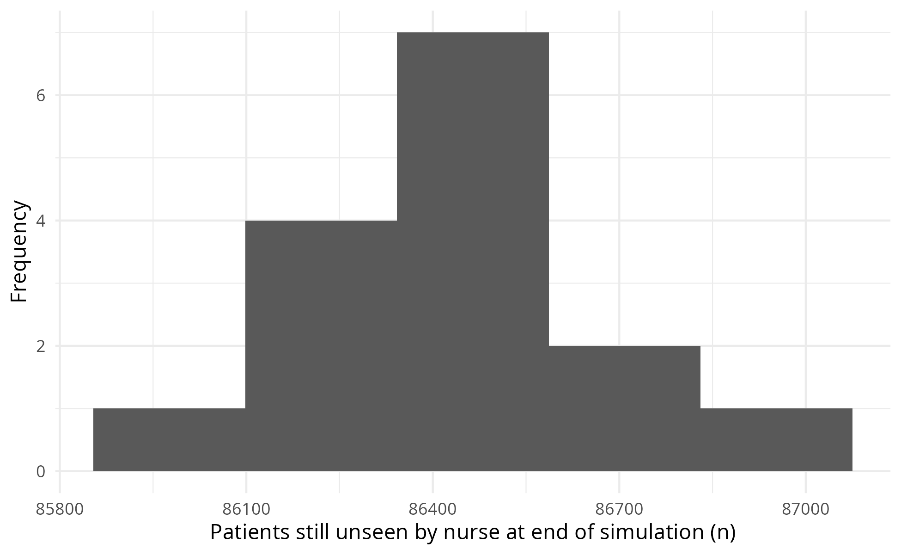
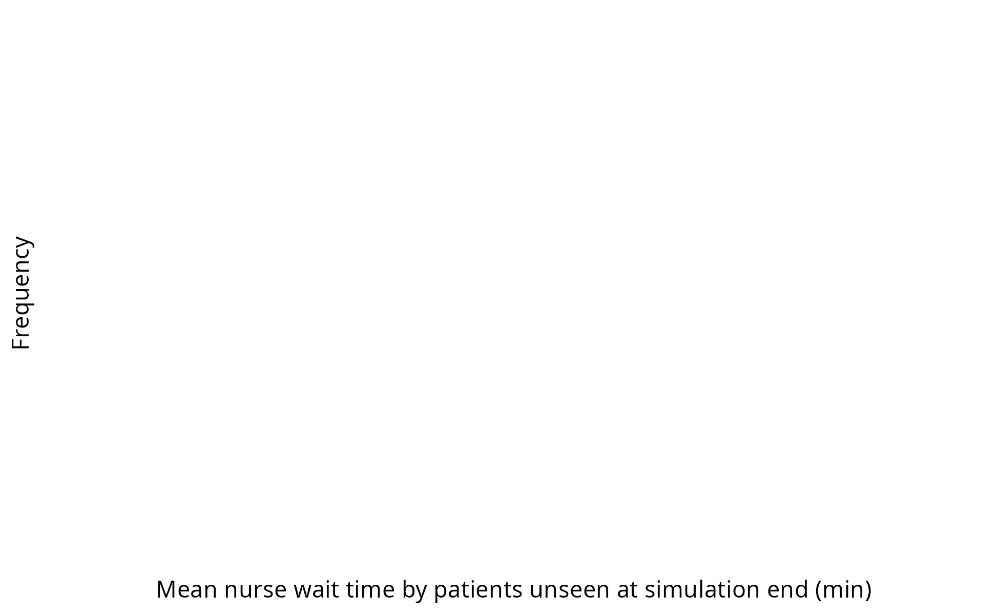

Analysis
================
Amy Heather
2025-08-04

- [Set up](#set-up)
- [Default run](#default-run)
- [View spread of results across
  replication](#view-spread-of-results-across-replication)
- [Scenario analysis](#scenario-analysis)
- [Sensitivity analysis](#sensitivity-analysis)
- [NaN results](#nan-results)
- [Calculate run time](#calculate-run-time)

This notebook presents execution and results from:

- Base case analysis
- Scenario analysis
- Sensitivity analysis

The generated images are saved and then loaded, so that we view the
image as saved (i.e. with the dimensions set in `ggsave()`). This also
avoids the creation of a `_files/` directory when knitting the document
(which would save all previewed images into that folder also, so they
can be rendered and displayed within the output `.md` file, even if we
had not specifically saved them). These are viewed using
`include_graphics()`, which must be the last command in the cell (or
last in the plotting function).

Some of these are used in the paper (`mock_paper.md`) - see below:

- **Figure 1:** `outputs/spread_arrivals.png`
- **Figure 2:** `outputs/scenario_nurse_util.png`
- **Figure 3:** `outputs/scenario_nurse_wait.png`
- **Figure 4:** `outputs/sensitivity_consult_time.png`

The run time is provided at the end of the notebook.

## Set up

Install the latest version of the local simulation package. If running
sequentially, `devtools::load_all()` is sufficient. If running in
parallel, you must use `devtools::install()` and then
`library(simulation)`.

``` r
devtools::load_all()
```

    ## ℹ Loading simulation

Import required packages.

``` r
# nolint start: undesirable_function_linter.
library(dplyr, warn.conflicts = FALSE)
library(ggplot2)
library(knitr)
library(tidyr, warn.conflicts = FALSE)
library(xtable)

options(dplyr.summarise.inform = FALSE)
# nolint end
```

Start timer.

``` r
start_time <- Sys.time()
```

Define path to outputs folder.

``` r
output_dir <- file.path("..", "outputs")
```

## Default run

Run with default parameters and save to `.csv`.

``` r
# Print out default parameters
print(parameters())
```

    ## $patient_inter
    ## [1] 4
    ## 
    ## $mean_n_consult_time
    ## [1] 10
    ## 
    ## $number_of_nurses
    ## [1] 5
    ## 
    ## $warm_up_period
    ## [1] 38880
    ## 
    ## $data_collection_period
    ## [1] 43200
    ## 
    ## $number_of_runs
    ## [1] 15
    ## 
    ## $scenario_name
    ## NULL
    ## 
    ## $cores
    ## [1] 1
    ## 
    ## $seed_offset
    ## [1] 0
    ## 
    ## $log_to_console
    ## [1] FALSE
    ## 
    ## $log_to_file
    ## [1] FALSE
    ## 
    ## $file_path
    ## NULL

``` r
# Run model
run_results <- runner(param = parameters())[["run_results"]]

# Preview results
head(run_results)
```

    ## # A tibble: 6 × 10
    ##   replication arrivals mean_patients_in_service mean_queue_length_nurse
    ##         <int>    <int>                    <dbl>                   <dbl>
    ## 1           1    10733                     2.57                  0.105 
    ## 2           2    10695                     2.55                  0.114 
    ## 3           3    10649                     2.65                  0.144 
    ## 4           4    10707                     2.53                  0.0800
    ## 5           5    10957                     2.72                  0.163 
    ## 6           6    10703                     2.58                  0.119 
    ## # ℹ 6 more variables: mean_waiting_time_nurse <dbl>,
    ## #   mean_serve_time_nurse <dbl>, utilisation_nurse <dbl>,
    ## #   count_unseen_nurse <int>, mean_waiting_time_unseen_nurse <dbl>,
    ## #   mean_time_in_system <dbl>

``` r
# Save results to csv
write.csv(run_results, file.path(output_dir, "base_run_results.csv"))
```

Can calculate overall results from across the replications as well…

``` r
# Calculate average results
run_results |>
  dplyr::select(!c(replication, arrivals)) |>
  gather() |>
  group_by(key) |>
  reframe(
    n_complete = sum(!is.na(value)),
    mean = mean(value, na.rm = TRUE),
    std_dev = stats::sd(value, na.rm = TRUE),
    ci_lower = (
      if (n_complete >= 2L) stats::t.test(value)$conf.int[1L] else NA_real_
    ),
    ci_upper = (
      if (n_complete >= 2L) stats::t.test(value)$conf.int[2L] else NA_real_
    )
  )
```

    ## # A tibble: 8 × 6
    ##   key                            n_complete    mean  std_dev ci_lower ci_upper
    ##   <chr>                               <int>   <dbl>    <dbl>    <dbl>    <dbl>
    ## 1 count_unseen_nurse                     15  0.0667  0.258    -0.0763    0.210
    ## 2 mean_patients_in_service               15  2.62    0.0515    2.59      2.65 
    ## 3 mean_queue_length_nurse                15  0.128   0.0219    0.116     0.140
    ## 4 mean_serve_time_nurse                  15  9.97    0.103     9.91     10.0  
    ## 5 mean_time_in_system                    15 10.5     0.160    10.4      10.6  
    ## 6 mean_waiting_time_nurse                15  0.516   0.0863    0.468     0.564
    ## 7 mean_waiting_time_unseen_nurse          1  1.19   NA        NA        NA    
    ## 8 utilisation_nurse                      15  0.498   0.00671   0.494     0.502

## View spread of results across replication

``` r
#' Plot spread of results from across replications, for chosen column.
#'
#' Generate figure, show it, and then save under specified file name.
#'
#' @param run_results The dataframe from the model results `run_results`.
#' @param column Name of column to plot.
#' @param x_label X axis label.
#' @param file Filename to save figure to.

plot_results_spread <- function(run_results, column, x_label, file) {

  # Generate plot
  p <- ggplot(run_results, aes(.data[[column]])) +
    geom_histogram(bins = 10L) +
    labs(x = x_label, y = "Frequency") +
    theme_minimal()

  # Save plot
  full_path <- file.path(output_dir, file)
  ggsave(filename = full_path, plot = p,
         width = 6.5, height = 4L, bg = "white")

  # View the plot
  include_graphics(full_path)
}
```

``` r
plot_results_spread(run_results = run_results,
                    column = "arrivals",
                    x_label = "Arrivals",
                    file = "spread_arrivals.png")
```

<!-- -->

``` r
plot_results_spread(run_results = run_results,
                    column = "mean_waiting_time_nurse",
                    x_label = "Mean wait time for nurse",
                    file = "spread_nurse_wait.png")
```

<!-- -->

``` r
plot_results_spread(run_results = run_results,
                    column = "mean_serve_time_nurse",
                    x_label = "Mean length of nurse consultation",
                    file = "spread_nurse_time.png")
```

<!-- -->

``` r
plot_results_spread(run_results = run_results,
                    column = "utilisation_nurse",
                    x_label = "Mean nurse utilisation",
                    file = "spread_nurse_util.png")
```

<!-- -->

## Scenario analysis

``` r
# Run scenario analysis
scenarios <- list(
  patient_inter = c(3L, 4L, 5L, 6L, 7L),
  number_of_nurses = c(5L, 6L, 7L, 8L)
)

scenario_results <- run_scenarios(scenarios, base_list = parameters())
```

    ## There are 20 scenarios.

    ## Base parameters:

    ## $patient_inter
    ## [1] 4
    ## 
    ## $mean_n_consult_time
    ## [1] 10
    ## 
    ## $number_of_nurses
    ## [1] 5
    ## 
    ## $warm_up_period
    ## [1] 38880
    ## 
    ## $data_collection_period
    ## [1] 43200
    ## 
    ## $number_of_runs
    ## [1] 15
    ## 
    ## $scenario_name
    ## NULL
    ## 
    ## $cores
    ## [1] 1
    ## 
    ## $seed_offset
    ## [1] 0
    ## 
    ## $log_to_console
    ## [1] FALSE
    ## 
    ## $log_to_file
    ## [1] FALSE
    ## 
    ## $file_path
    ## NULL

    ## Scenario: patient_inter = 3, number_of_nurses = 5

    ## Scenario: patient_inter = 4, number_of_nurses = 5

    ## Scenario: patient_inter = 5, number_of_nurses = 5

    ## Scenario: patient_inter = 6, number_of_nurses = 5

    ## Scenario: patient_inter = 7, number_of_nurses = 5

    ## Scenario: patient_inter = 3, number_of_nurses = 6

    ## Scenario: patient_inter = 4, number_of_nurses = 6

    ## Scenario: patient_inter = 5, number_of_nurses = 6

    ## Scenario: patient_inter = 6, number_of_nurses = 6

    ## Scenario: patient_inter = 7, number_of_nurses = 6

    ## Scenario: patient_inter = 3, number_of_nurses = 7

    ## Scenario: patient_inter = 4, number_of_nurses = 7

    ## Scenario: patient_inter = 5, number_of_nurses = 7

    ## Scenario: patient_inter = 6, number_of_nurses = 7

    ## Scenario: patient_inter = 7, number_of_nurses = 7

    ## Scenario: patient_inter = 3, number_of_nurses = 8

    ## Scenario: patient_inter = 4, number_of_nurses = 8

    ## Scenario: patient_inter = 5, number_of_nurses = 8

    ## Scenario: patient_inter = 6, number_of_nurses = 8

    ## Scenario: patient_inter = 7, number_of_nurses = 8

``` r
# Preview scenario results dataframe
print(dim(scenario_results))
```

    ## [1] 300  13

``` r
head(scenario_results)
```

    ## # A tibble: 6 × 13
    ##   replication arrivals mean_patients_in_service mean_queue_length_nurse
    ##         <int>    <int>                    <dbl>                   <dbl>
    ## 1           1    14212                     3.85                   0.580
    ## 2           2    14360                     3.86                   0.567
    ## 3           3    14406                     4.27                   0.838
    ## 4           4    14375                     4.01                   0.666
    ## 5           5    14502                     4.02                   0.656
    ## 6           6    14229                     3.76                   0.506
    ## # ℹ 9 more variables: mean_waiting_time_nurse <dbl>,
    ## #   mean_serve_time_nurse <dbl>, utilisation_nurse <dbl>,
    ## #   count_unseen_nurse <int>, mean_waiting_time_unseen_nurse <dbl>,
    ## #   mean_time_in_system <dbl>, scenario <int>, patient_inter <int>,
    ## #   number_of_nurses <int>

Example plot

``` r
#' Plot results from different model scenarios.
#'
#' @param results Dataframe with results from each replication of scenarios.
#' @param x_var Name of variable to plot on X axis.
#' @param result_var Name of variable with results, to plot on Y axis.
#' @param colour_var Name of variable to colour lines with (or set to NULL).
#' @param xaxis_title Title for X axis.
#' @param yaxis_title Title for Y axis.
#' @param legend_title Title for figure legend.
#' @param path Path inc. filename to save figure to.
#'
#' @return Dataframe with the average results calculated.

plot_scenario <- function(results, x_var, result_var, colour_var, xaxis_title,
                          yaxis_title, legend_title, path) {
  # If x_var and colour_var are provided, combine both in a list to use
  # as grouping variables when calculating average results
  if (!is.null(colour_var)) {
    group_vars <- c(x_var, colour_var)
  } else {
    group_vars <- c(x_var)
  }

  # Calculate average results from each scenario
  avg_results <- results |>
    group_by_at(group_vars) |>
    summarise(mean = mean(.data[[result_var]]),
              std_dev = sd(.data[[result_var]]),
              ci_lower = t.test(.data[[result_var]])[["conf.int"]][[1L]],
              ci_upper = t.test(.data[[result_var]])[["conf.int"]][[2L]])

  # Generate plot - with or without colour, depending on whether it was given
  if (!is.null(colour_var)) {
    # Convert colour variable to factor so it is treated like categorical
    avg_results[[colour_var]] <- as.factor(avg_results[[colour_var]])
    # Create plot
    p <- ggplot(avg_results, aes(x = .data[[x_var]], y = mean,
                                 group = .data[[colour_var]])) +
      geom_line(aes(color = .data[[colour_var]])) +
      geom_ribbon(aes(ymin = .data[["ci_lower"]], ymax = .data[["ci_upper"]],
                      fill = .data[[colour_var]]), alpha = 0.1)
  } else {
    # Create plot
    p <- ggplot(avg_results, aes(x = .data[[x_var]], y = mean)) +
      geom_line() +
      geom_ribbon(aes(ymin = .data[["ci_lower"]], ymax = .data[["ci_upper"]]),
                  alpha = 0.1)
  }

  # Modify labels and style
  p <- p +
    labs(x = xaxis_title, y = yaxis_title, color = legend_title,
         fill = legend_title) +
    theme_minimal()

  # Save plot
  ggsave(filename = path, width = 6.5, height = 4L, bg = "white")

  # Return the results dataframe
  return(avg_results) # nolint: object_overwrite_linter
}
```

``` r
# Define path
path <- file.path(output_dir, "scenario_nurse_wait.png")

# Calculate results and generate plot
result <- plot_scenario(
  results = scenario_results,
  x_var = "patient_inter",
  result_var = "mean_waiting_time_nurse",
  colour_var = "number_of_nurses",
  xaxis_title = "Patient inter-arrival time",
  yaxis_title = "Mean wait time for nurse (minutes)",
  legend_title = "Nurses",
  path = path
)

# View plot
include_graphics(path)
```

<!-- -->

``` r
# Define path
path <- file.path(output_dir, "scenario_nurse_util.png")

# Calculate results and generate plot
result <- plot_scenario(
  results = scenario_results,
  x_var = "patient_inter",
  result_var = "utilisation_nurse",
  colour_var = "number_of_nurses",
  xaxis_title = "Patient inter-arrival time",
  yaxis_title = "Mean nurse utilisation",
  legend_title = "Nurses",
  path = path
)

# View plot
include_graphics(path)
```

<!-- -->

Example table.

``` r
# Process table
table <- result |>
  # Combine mean and CI into single column, and round
  mutate(mean_ci = sprintf("%.2f (%.2f, %.2f)", mean, ci_lower, ci_upper),
         nurses = sprintf("% s nurses", number_of_nurses)) |>
  dplyr::select(patient_inter, nurses, mean_ci) |>
  # Convert from long to wide format
  pivot_wider(names_from = nurses, values_from = mean_ci) |>
  rename(`Patient inter-arrival time` = patient_inter)

# Convert to latex, display and save
table_latex <- xtable(table)
print(table_latex)
```

    ## % latex table generated in R 4.4.1 by xtable 1.8-4 package
    ## % Mon Aug  4 15:49:45 2025
    ## \begin{table}[ht]
    ## \centering
    ## \begin{tabular}{rrllll}
    ##   \hline
    ##  & Patient inter-arrival time & 5 nurses & 6 nurses & 7 nurses & 8 nurses \\ 
    ##   \hline
    ## 1 &   3 & 0.67 (0.66, 0.67) & 0.55 (0.55, 0.56) & 0.48 (0.47, 0.48) & 0.42 (0.41, 0.42) \\ 
    ##   2 &   4 & 0.50 (0.49, 0.50) & 0.42 (0.41, 0.42) & 0.36 (0.35, 0.36) & 0.31 (0.31, 0.31) \\ 
    ##   3 &   5 & 0.40 (0.40, 0.41) & 0.33 (0.33, 0.34) & 0.29 (0.28, 0.29) & 0.25 (0.25, 0.25) \\ 
    ##   4 &   6 & 0.33 (0.33, 0.34) & 0.28 (0.28, 0.28) & 0.24 (0.24, 0.24) & 0.21 (0.21, 0.21) \\ 
    ##   5 &   7 & 0.29 (0.28, 0.29) & 0.24 (0.24, 0.24) & 0.20 (0.20, 0.21) & 0.18 (0.18, 0.18) \\ 
    ##    \hline
    ## \end{tabular}
    ## \end{table}

``` r
print(table_latex,
      comment = FALSE,
      file = file.path(output_dir, "scenario_nurse_util.tex"))
```

## Sensitivity analysis

Can use similar code to perform sensitivity analyses.

**How does sensitivity analysis differ from scenario analysis?**

- Scenario analysis focuses on a set of predefined situations which are
  plausible or relevant to the problem being studied. It can often
  involve varying multiple parameters simulatenously. The purpose is to
  understand how the system operates under different hypothetical
  scenarios.
- Sensitivity analysis varies one (or a small group) of parameters and
  assesses the impact of small changes in that parameter on outcomes.
  The purpose is to understand how uncertainty in the inputs affects the
  model, and how robust results are to variation in those inputs.

``` r
# Run sensitivity analysis
consult <- list(mean_n_consult_time = c(8L, 9L, 10L, 11L, 12L, 13L, 14L, 15L))
sensitivity_consult <- run_scenarios(consult, base_list = parameters())
```

    ## There are 8 scenarios.

    ## Base parameters:

    ## $patient_inter
    ## [1] 4
    ## 
    ## $mean_n_consult_time
    ## [1] 10
    ## 
    ## $number_of_nurses
    ## [1] 5
    ## 
    ## $warm_up_period
    ## [1] 38880
    ## 
    ## $data_collection_period
    ## [1] 43200
    ## 
    ## $number_of_runs
    ## [1] 15
    ## 
    ## $scenario_name
    ## NULL
    ## 
    ## $cores
    ## [1] 1
    ## 
    ## $seed_offset
    ## [1] 0
    ## 
    ## $log_to_console
    ## [1] FALSE
    ## 
    ## $log_to_file
    ## [1] FALSE
    ## 
    ## $file_path
    ## NULL

    ## Scenario: mean_n_consult_time = 8

    ## Scenario: mean_n_consult_time = 9

    ## Scenario: mean_n_consult_time = 10

    ## Scenario: mean_n_consult_time = 11

    ## Scenario: mean_n_consult_time = 12

    ## Scenario: mean_n_consult_time = 13

    ## Scenario: mean_n_consult_time = 14

    ## Scenario: mean_n_consult_time = 15

``` r
# Preview result
head(sensitivity_consult)
```

    ## # A tibble: 6 × 12
    ##   replication arrivals mean_patients_in_service mean_queue_length_nurse
    ##         <int>    <int>                    <dbl>                   <dbl>
    ## 1           1    10759                     2.03                  0.0500
    ## 2           2    10727                     1.99                  0.0358
    ## 3           3    10656                     2.06                  0.0447
    ## 4           4    10765                     2.02                  0.0354
    ## 5           5    10976                     2.09                  0.0426
    ## 6           6    10744                     2.03                  0.0390
    ## # ℹ 8 more variables: mean_waiting_time_nurse <dbl>,
    ## #   mean_serve_time_nurse <dbl>, utilisation_nurse <dbl>,
    ## #   count_unseen_nurse <int>, mean_waiting_time_unseen_nurse <dbl>,
    ## #   mean_time_in_system <dbl>, scenario <int>, mean_n_consult_time <int>

``` r
# Define path
path <- file.path(output_dir, "sensitivity_consult_time.png")

# Calculate results and generate plot
sensitivity_result <- plot_scenario(
  results = sensitivity_consult,
  x_var = "mean_n_consult_time",
  result_var = "mean_waiting_time_nurse",
  colour_var = NULL,
  xaxis_title = "Mean nurse consultation time (minutes)",
  yaxis_title = "Mean wait time for nurse (minutes)",
  legend_title = "Nurses",
  path = path
)

# View plot
include_graphics(path)
```

<!-- -->

``` r
# Process table
sensitivity_table <- sensitivity_result  |>
  # Combine mean and CI into single column, and round
  mutate(mean_ci = sprintf("%.2f (%.2f, %.2f)", mean, ci_lower, ci_upper)) |>
  # Select and rename columns
  dplyr::select(mean_n_consult_time, mean_ci) |>
  rename(`Mean nurse consultation time` = mean_n_consult_time,
         `Mean wait time for nurse (95 percent confidence interval)` = mean_ci)

# Convert to latex, display and save
sensitivity_table_latex <- xtable(sensitivity_table)
print(sensitivity_table_latex)
```

    ## % latex table generated in R 4.4.1 by xtable 1.8-4 package
    ## % Mon Aug  4 15:50:50 2025
    ## \begin{table}[ht]
    ## \centering
    ## \begin{tabular}{rrl}
    ##   \hline
    ##  & Mean nurse consultation time & Mean wait time for nurse (95 percent confidence interval) \\ 
    ##   \hline
    ## 1 &   8 & 0.16 (0.15, 0.17) \\ 
    ##   2 &   9 & 0.29 (0.27, 0.31) \\ 
    ##   3 &  10 & 0.52 (0.47, 0.56) \\ 
    ##   4 &  11 & 0.88 (0.83, 0.94) \\ 
    ##   5 &  12 & 1.44 (1.35, 1.52) \\ 
    ##   6 &  13 & 2.16 (2.04, 2.28) \\ 
    ##   7 &  14 & 3.44 (3.25, 3.64) \\ 
    ##   8 &  15 & 5.33 (4.98, 5.67) \\ 
    ##    \hline
    ## \end{tabular}
    ## \end{table}

``` r
print(sensitivity_table_latex,
      comment = FALSE,
      file = file.path(output_dir, "sensitivity_consult_time.tex"))
```

## NaN results

If patients are still waiting to be seen at the end of the simulation,
or are still busy with the resource at the end of the simulation, they
will have NaN results for `end_time` and `activity_time` (and so for the
calculated nurse wait and activity times).

These patients are captured in the `wait_time_unseen` column in
`arrivals`, and in the `count_unseen_nurse` and
`mean_waiting_time_unseen_nurse` columns in `run_results`.

These patients will be ignored in calculation of metrics like mean time
with nurse (as they don’t get to see nurse) - but it’s important we
still have measures for those unseen, as lots of patients waiting at the
end of the simulation reveals large backlogs in the system.

``` r
# Set up parameters with short inter-arrival time
param <- parameters(patient_inter = 0.5)
print(param)
```

    ## $patient_inter
    ## [1] 0.5
    ## 
    ## $mean_n_consult_time
    ## [1] 10
    ## 
    ## $number_of_nurses
    ## [1] 5
    ## 
    ## $warm_up_period
    ## [1] 38880
    ## 
    ## $data_collection_period
    ## [1] 43200
    ## 
    ## $number_of_runs
    ## [1] 15
    ## 
    ## $scenario_name
    ## NULL
    ## 
    ## $cores
    ## [1] 1
    ## 
    ## $seed_offset
    ## [1] 0
    ## 
    ## $log_to_console
    ## [1] FALSE
    ## 
    ## $log_to_file
    ## [1] FALSE
    ## 
    ## $file_path
    ## NULL

``` r
# Run replications
nan_experiment <- runner(param)
```

``` r
nan_experiment[["arrivals"]] |>
  arrange(replication, start_time) |>
  tail()
```

    ## # A tibble: 6 × 12
    ##   name   start_time end_time activity_time resource replication queue_on_arrival
    ##   <chr>       <dbl>    <dbl>         <dbl> <chr>          <int>            <dbl>
    ## 1 patie…     82077.       NA            NA nurse             15           122790
    ## 2 patie…     82078.       NA            NA nurse             15           122791
    ## 3 patie…     82079.       NA            NA nurse             15           122792
    ## 4 patie…     82079.       NA            NA nurse             15           122793
    ## 5 patie…     82079.       NA            NA nurse             15           122794
    ## 6 patie…     82080.       NA            NA nurse             15           122794
    ## # ℹ 5 more variables: serve_start <dbl>, serve_length <dbl>,
    ## #   time_in_system <dbl>, wait_time <dbl>, wait_time_unseen <dbl>

``` r
nan_experiment[["run_results"]][c(
  "replication", "count_unseen_nurse", "mean_waiting_time_nurse"
)]
```

    ## # A tibble: 15 × 3
    ##    replication count_unseen_nurse mean_waiting_time_nurse
    ##          <int>              <int>                   <dbl>
    ##  1           1              86978                      NA
    ##  2           2              86107                      NA
    ##  3           3              86381                      NA
    ##  4           4              86562                      NA
    ##  5           5              86669                      NA
    ##  6           6              86416                      NA
    ##  7           7              86286                      NA
    ##  8           8              86222                      NA
    ##  9           9              86557                      NA
    ## 10          10              86558                      NA
    ## 11          11              86403                      NA
    ## 12          12              86629                      NA
    ## 13          13              86127                      NA
    ## 14          14              86001                      NA
    ## 15          15              86568                      NA

``` r
plot_results_spread(
  run_results = nan_experiment[["run_results"]],
  column = "count_unseen_nurse",
  x_label = "Patients still unseen by nurse at end of simulation (n)",
  file = "spread_nan_count_unseen.png"
)
```

<!-- -->

``` r
plot_results_spread(
  run_results = nan_experiment[["run_results"]],
  column = "mean_waiting_time_nurse",
  x_label = "Mean nurse wait time by patients unseen at simulation end (min)",
  file = "spread_nan_wait_unseen.png"
)
```

    ## Warning: Removed 15 rows containing non-finite outside the scale range
    ## (`stat_bin()`).

<!-- -->

## Calculate run time

``` r
# Get run time in seconds
end_time <- Sys.time()
runtime <- as.numeric(end_time - start_time, units = "secs")

# Display converted to minutes and seconds
minutes <- as.integer(runtime / 60L)
seconds <- as.integer(runtime %% 60L)
cat(sprintf("Notebook run time: %dm %ds", minutes, seconds))
```

    ## Notebook run time: 4m 31s
