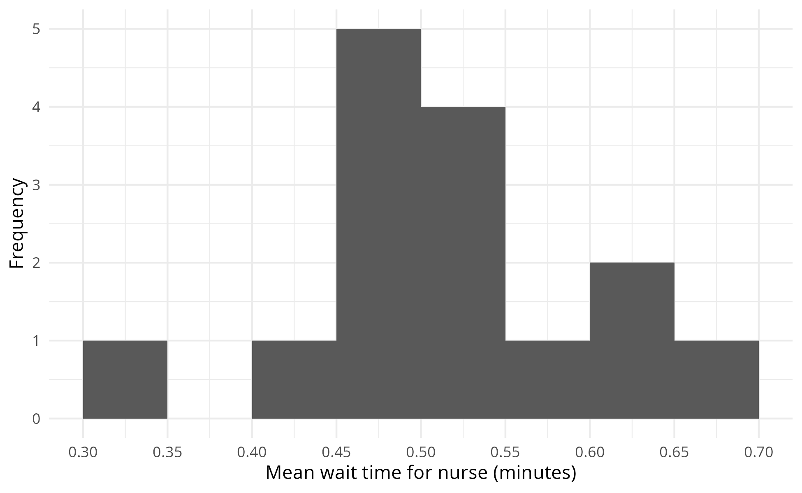
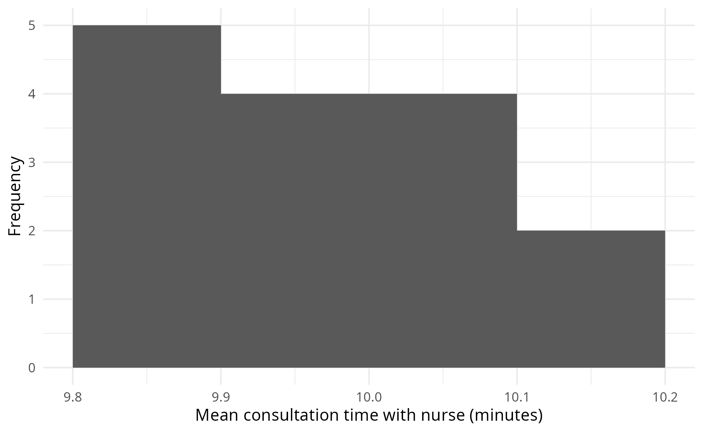
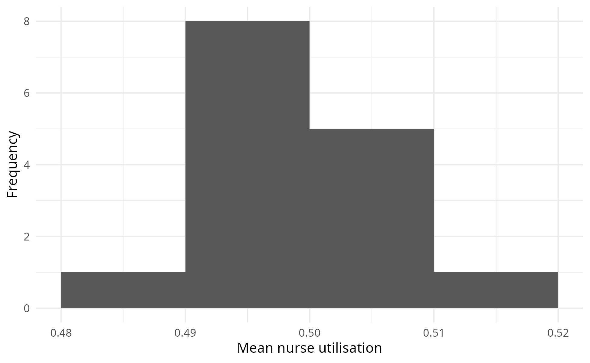
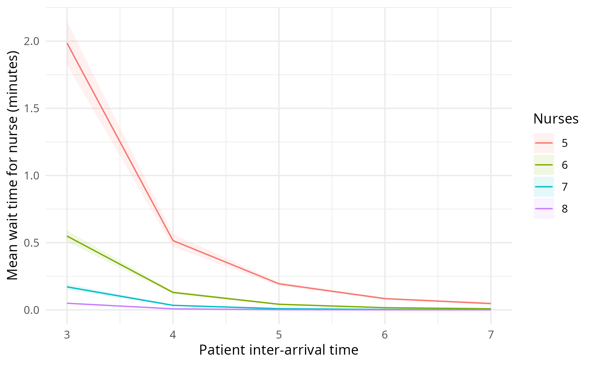

Analysis
================
Amy Heather
2025-02-03

- [Set up](#set-up)
- [Default run](#default-run)
- [View spread of results across
  replication](#view-spread-of-results-across-replication)
- [Scenario analysis](#scenario-analysis)
  - [Running a basic example (which can compare to Python
    template)](#running-a-basic-example-which-can-compare-to-python-template)
- [Sensitivity analysis](#sensitivity-analysis)
- [NaN results](#nan-results)
- [Example run with logs](#example-run-with-logs)
- [Calculate run time](#calculate-run-time)

This notebook presents execution and results from:

- Base case analysis
- Scenario analysis
- Sensitivity analysis

The generated images are saved and then loaded, so that we view the
image as saved (i.e. with the dimensions set in `ggsave()`). This also
avoids the creation of a `_files/` directory when knitting the document
(which would save all previewed images into that folder also, so they
can be rendered and displayed within the output `.md` file, even if we
had not specifically saved them). These are viewed using
`include_graphics()`, which must be the last command in the cell (or
last in the plotting function).

The run time is provided at the end of the notebook.

## Set up

Install the latest version of the local simulation package.

``` r
# devtools::install()
devtools::load_all()
```

    ## ℹ Loading simulation

Import required packages.

``` r
# nolint start: undesirable_function_linter.
library(dplyr, warn.conflicts = FALSE)
library(ggplot2)
library(knitr)
library(simmer, warn.conflicts = FALSE)
library(simulation)
library(tidyr, warn.conflicts = FALSE)
library(xtable)

options(dplyr.summarise.inform = FALSE)
# nolint end
```

Start timer.

``` r
start_time <- Sys.time()
```

Define path to outputs folder.

``` r
output_dir <- file.path("..", "outputs")
```

## Default run

Run with default parameters.

``` r
envs <- trial(param = parameters())
```

Process results and save to `.csv`.

``` r
trial_results <- process_replications(envs)
head(trial_results)
```

    ## # A tibble: 6 × 5
    ##   replication arrivals mean_waiting_time_nurse mean_activity_time_nurse
    ##         <int>    <int>                   <dbl>                    <dbl>
    ## 1           1       21                  0.173                     10.7 
    ## 2           2       16                  0                          7.10
    ## 3           3       13                  0                          6.89
    ## 4           4       16                  0.0177                     9.29
    ## 5           5       17                  0                          4.79
    ## 6           6       18                  0.393                      8.12
    ## # ℹ 1 more variable: utilisation_nurse <dbl>

``` r
write.csv(trial_results, file.path(output_dir, "base_trial.csv"))
```

## View spread of results across replication

``` r
#' Plot spread of results from across replications, for chosen column.
#'
#' Generate figure, show it, and then save under specified file name.
#'
#' @param column Name of column to plot.
#' @param x_label X axis label.
#' @param file Filename to save figure to.

plot_results_spread <- function(column, x_label, file) {

  # Generate plot
  p <- ggplot(trial_results, aes(.data[[column]])) +
    geom_histogram(bins = 10L) +
    labs(x = x_label, y = "Frequency") +
    theme_minimal()

  # Save plot
  full_path <- file.path(output_dir, file)
  ggsave(filename = full_path, plot = p,
         width = 6.5, height = 4L, bg = "white")

  # View the plot
  include_graphics(full_path)
}
```

``` r
plot_results_spread(column = "arrivals",
                    x_label = "Arrivals",
                    file = "spread_arrivals.png")
```

<!-- -->

``` r
plot_results_spread(column = "mean_waiting_time_nurse",
                    x_label = "Mean wait time for nurse",
                    file = "spread_nurse_wait.png")
```

<!-- -->

``` r
plot_results_spread(column = "mean_activity_time_nurse",
                    x_label = "Mean length of nurse consultation",
                    file = "spread_nurse_time.png")
```

<!-- -->

``` r
plot_results_spread(column = "utilisation_nurse",
                    x_label = "Mean nurse utilisation",
                    file = "spread_nurse_util.png")
```

<!-- -->

## Scenario analysis

``` r
#' Run a set of scenarios
#'
#' @param scenarios List where key is name of parameter and value is a list of
#' different values to run in scenarios
#' @param base_list List of parameters to use as base for scenarios, which can
#' be partial (as will input to parameters() function).
#'
#' @return Tibble with results from each replication for each scenario.

run_scenarios <- function(scenarios, base_list) {
  # Generate all permutations of the scenarios
  all_scenarios <- expand.grid(scenarios)

  # Preview the number of scenarios
  print(sprintf("There are %d scenarios. Running:", nrow(all_scenarios)))

  results <- list()

  # Iterate through each scenario
  for (index in seq_len(nrow(all_scenarios))) {

    # Filter to one of the scenarios
    scenario_to_run <- all_scenarios[index, , drop = FALSE]

    # Print the scenario parameters
    formatted_scenario <- toString(
      paste0(names(scenario_to_run), " = ", scenario_to_run)
    )
    print(paste0("Scenario: ", formatted_scenario))

    # Create parameter list with scenario-specific values
    args <- c(scenario_to_run, list(scenario_name = index))

    # Create instance of parameter class with specified base parameters
    param <- do.call(parameters, base_list)

    # Update parameter list with the scenario parameters
    for (name in names(args)) {
      param[[name]] <- args[[name]]
    }

    # Run the trial for the current scenario
    envs <- trial(param)

    # Extract results
    scenario_result <- process_replications(envs)

    # Append scenario parameters to the results
    scenario_result[["scenario"]] <- index
    for (key in names(scenario_to_run)) {
      scenario_result[[key]] <- scenario_to_run[[key]]
    }

    # Append to results list
    results[[index]] <- scenario_result
  }
  return(do.call(rbind, results))
}
```

``` r
# Run scenario analysis
scenarios <- list(
  patient_inter = c(3L, 4L, 5L, 6L, 7L),
  number_of_nurses = c(5L, 6L, 7L, 8L)
)

scenario_results <- run_scenarios(scenarios, base_list=parameters())
```

    ## [1] "There are 20 scenarios. Running:"
    ## [1] "Scenario: patient_inter = 3, number_of_nurses = 5"
    ## [1] "Scenario: patient_inter = 4, number_of_nurses = 5"
    ## [1] "Scenario: patient_inter = 5, number_of_nurses = 5"
    ## [1] "Scenario: patient_inter = 6, number_of_nurses = 5"
    ## [1] "Scenario: patient_inter = 7, number_of_nurses = 5"
    ## [1] "Scenario: patient_inter = 3, number_of_nurses = 6"
    ## [1] "Scenario: patient_inter = 4, number_of_nurses = 6"
    ## [1] "Scenario: patient_inter = 5, number_of_nurses = 6"
    ## [1] "Scenario: patient_inter = 6, number_of_nurses = 6"
    ## [1] "Scenario: patient_inter = 7, number_of_nurses = 6"
    ## [1] "Scenario: patient_inter = 3, number_of_nurses = 7"
    ## [1] "Scenario: patient_inter = 4, number_of_nurses = 7"
    ## [1] "Scenario: patient_inter = 5, number_of_nurses = 7"
    ## [1] "Scenario: patient_inter = 6, number_of_nurses = 7"
    ## [1] "Scenario: patient_inter = 7, number_of_nurses = 7"
    ## [1] "Scenario: patient_inter = 3, number_of_nurses = 8"
    ## [1] "Scenario: patient_inter = 4, number_of_nurses = 8"
    ## [1] "Scenario: patient_inter = 5, number_of_nurses = 8"
    ## [1] "Scenario: patient_inter = 6, number_of_nurses = 8"
    ## [1] "Scenario: patient_inter = 7, number_of_nurses = 8"

``` r
# Preview scenario results dataframe
print(dim(scenario_results))
```

    ## [1] 2000    8

``` r
head(scenario_results)
```

    ## # A tibble: 6 × 8
    ##   replication arrivals mean_waiting_time_nurse mean_activity_time_nurse
    ##         <int>    <int>                   <dbl>                    <dbl>
    ## 1           1       26                  0.287                      9.10
    ## 2           2       19                  0                          7.83
    ## 3           3       22                  0.0192                     6.74
    ## 4           4       21                  0.249                      7.97
    ## 5           5       25                  0.246                      5.75
    ## 6           6       27                  3.22                      10.0 
    ## # ℹ 4 more variables: utilisation_nurse <dbl>, scenario <int>,
    ## #   patient_inter <int>, number_of_nurses <int>

Example plot

``` r
#' Plot results from different model scenarios.
#'
#' @param results Dataframe with results from each replication of scenarios.
#' @param x_var Name of variable to plot on X axis.
#' @param result_var Name of variable with results, to plot on Y axis.
#' @param colour_var Name of variable to colour lines with (or set to NULL).
#' @param xaxis_title Title for X axis.
#' @param yaxis_title Title for Y axis.
#' @param legend_title Title for figure legend.
#' @param path Path inc. filename to save figure to.
#'
#' @return Dataframe with the average results calculated.

plot_scenario <- function(results, x_var, result_var, colour_var, xaxis_title,
                          yaxis_title, legend_title, path) {
  # If x_var and colour_var are provided, combine both in a list to use
  # as grouping variables when calculating average results
  if (!is.null(colour_var)) {
    group_vars <- c(x_var, colour_var)
  } else {
    group_vars <- c(x_var)
  }

  # Calculate average results from each scenario
  df <- results %>%
    group_by_at(group_vars) %>%
    summarise(mean = mean(.data[[result_var]]),
              std_dev = sd(.data[[result_var]]),
              ci_lower = t.test(.data[[result_var]])[["conf.int"]][[1L]],
              ci_upper = t.test(.data[[result_var]])[["conf.int"]][[2L]])

  # Generate plot - with or without colour, depending on whether it was given
  if (!is.null(colour_var)) {
    # Convert colour variable to factor so it is treated like categorical
    df[[colour_var]] <- as.factor(df[[colour_var]])
    # Create plot
    p <- ggplot(df, aes(x = .data[[x_var]], y = mean,
                        group = .data[[colour_var]])) +
      geom_line(aes(color = .data[[colour_var]])) +
      geom_ribbon(aes(ymin = .data[["ci_lower"]], ymax = .data[["ci_upper"]],
                      fill = .data[[colour_var]]), alpha = 0.1)
  } else {
    # Create plot
    p <- ggplot(df, aes(x = .data[[x_var]], y = mean)) +
      geom_line() +
      geom_ribbon(aes(ymin = .data[["ci_lower"]], ymax = .data[["ci_upper"]]),
                  alpha = 0.1)
  }

  # Modify labels and style
  p <- p +
    labs(x = xaxis_title, y = yaxis_title, color = legend_title,
         fill = legend_title) +
    theme_minimal()

  # Save plot
  ggsave(filename = path, width = 6.5, height = 4L, bg = "white")

  # Return the results dataframe
  return(df)
}
```

``` r
# Define path
path <- file.path(output_dir, "scenario_nurse_wait.png")

# Calculate results and generate plot
result <- plot_scenario(
  results = scenario_results,
  x_var = "patient_inter",
  result_var = "mean_waiting_time_nurse",
  colour_var = "number_of_nurses",
  xaxis_title = "Patient inter-arrival time",
  yaxis_title = "Mean wait time for nurse (minutes)",
  legend_title = "Nurses",
  path = path
)

# View plot
include_graphics(path)
```

<!-- -->

``` r
# Define path
path <- file.path(output_dir, "scenario_nurse_util.png")

# Calculate results and generate plot
result <- plot_scenario(
  results = scenario_results,
  x_var = "patient_inter",
  result_var = "utilisation_nurse",
  colour_var = "number_of_nurses",
  xaxis_title = "Patient inter-arrival time",
  yaxis_title = "Mean nurse utilisation",
  legend_title = "Nurses",
  path = path
)

# View plot
include_graphics(path)
```

<!-- -->

Example table.

``` r
# Process table
table <- result %>%
  # Combine mean and CI into single column, and round
  mutate(mean_ci = sprintf("%.2f (%.2f, %.2f)", mean, ci_lower, ci_upper),
         nurses = sprintf("% s nurses", number_of_nurses)) %>%
  dplyr::select(patient_inter, nurses, mean_ci) %>%
  # Convert from long to wide format
  pivot_wider(names_from = nurses, values_from = mean_ci) %>%
  rename(`Patient inter-arrival time` = patient_inter)

# Convert to latex, display and save
table_latex <- xtable(table)
print(table_latex)
```

    ## % latex table generated in R 4.4.1 by xtable 1.8-4 package
    ## % Mon Feb  3 12:15:42 2025
    ## \begin{table}[ht]
    ## \centering
    ## \begin{tabular}{rrllll}
    ##   \hline
    ##  & Patient inter-arrival time & 5 nurses & 6 nurses & 7 nurses & 8 nurses \\ 
    ##   \hline
    ## 1 &   3 & 0.60 (0.57, 0.63) & 0.51 (0.49, 0.54) & 0.44 (0.42, 0.46) & 0.39 (0.36, 0.41) \\ 
    ##   2 &   4 & 0.47 (0.44, 0.50) & 0.39 (0.37, 0.42) & 0.34 (0.32, 0.36) & 0.30 (0.28, 0.31) \\ 
    ##   3 &   5 & 0.38 (0.36, 0.41) & 0.32 (0.30, 0.34) & 0.28 (0.26, 0.30) & 0.24 (0.22, 0.26) \\ 
    ##   4 &   6 & 0.32 (0.29, 0.35) & 0.27 (0.24, 0.29) & 0.23 (0.21, 0.25) & 0.20 (0.18, 0.22) \\ 
    ##   5 &   7 & 0.28 (0.26, 0.31) & 0.24 (0.21, 0.26) & 0.20 (0.18, 0.22) & 0.18 (0.16, 0.19) \\ 
    ##    \hline
    ## \end{tabular}
    ## \end{table}

``` r
print(table_latex,
      comment = FALSE,
      file = file.path(output_dir, "scenario_nurse_util.tex"))
```

### Running a basic example (which can compare to Python template)

To enable comparison between the templates, this section runs the model
with a simple set of base case parameters (matched to Python), and then
running some scenarios on top of that base case.

``` r
# Define the base param for this altered run
new_base <- parameters(
  patient_inter = 4L,
  mean_n_consult_time = 10L,
  number_of_nurses = 5L,
  # No warm-up (not possible in R, but set to 0 in Python)
  data_collection_period = 1440, 
  number_of_runs = 10,
  cores = 1
)

# Define scenarios
scenarios <- list(
  patient_inter = c(3L, 4L, 5L, 6L, 7L),
  number_of_nurses = c(5L, 6L, 7L, 8L)
)

# Run scenarios
compare_template_results <- run_scenarios(scenarios, new_base)
```

    ## [1] "There are 20 scenarios. Running:"
    ## [1] "Scenario: patient_inter = 3, number_of_nurses = 5"
    ## [1] "Scenario: patient_inter = 4, number_of_nurses = 5"
    ## [1] "Scenario: patient_inter = 5, number_of_nurses = 5"
    ## [1] "Scenario: patient_inter = 6, number_of_nurses = 5"
    ## [1] "Scenario: patient_inter = 7, number_of_nurses = 5"
    ## [1] "Scenario: patient_inter = 3, number_of_nurses = 6"
    ## [1] "Scenario: patient_inter = 4, number_of_nurses = 6"
    ## [1] "Scenario: patient_inter = 5, number_of_nurses = 6"
    ## [1] "Scenario: patient_inter = 6, number_of_nurses = 6"
    ## [1] "Scenario: patient_inter = 7, number_of_nurses = 6"
    ## [1] "Scenario: patient_inter = 3, number_of_nurses = 7"
    ## [1] "Scenario: patient_inter = 4, number_of_nurses = 7"
    ## [1] "Scenario: patient_inter = 5, number_of_nurses = 7"
    ## [1] "Scenario: patient_inter = 6, number_of_nurses = 7"
    ## [1] "Scenario: patient_inter = 7, number_of_nurses = 7"
    ## [1] "Scenario: patient_inter = 3, number_of_nurses = 8"
    ## [1] "Scenario: patient_inter = 4, number_of_nurses = 8"
    ## [1] "Scenario: patient_inter = 5, number_of_nurses = 8"
    ## [1] "Scenario: patient_inter = 6, number_of_nurses = 8"
    ## [1] "Scenario: patient_inter = 7, number_of_nurses = 8"

``` r
# Preview scenario results dataframe
print(dim(compare_template_results))
```

    ## [1] 200   8

``` r
head(compare_template_results)
```

    ## # A tibble: 6 × 8
    ##   replication arrivals mean_waiting_time_nurse mean_activity_time_nurse
    ##         <int>    <int>                   <dbl>                    <dbl>
    ## 1           1      471                    1.69                    10.3 
    ## 2           2      502                    3.36                    10.3 
    ## 3           3      483                    1.86                    10.1 
    ## 4           4      461                    2.73                    10.6 
    ## 5           5      466                    1.25                     9.71
    ## 6           6      466                    2.13                    10.3 
    ## # ℹ 4 more variables: utilisation_nurse <dbl>, scenario <int>,
    ## #   patient_inter <int>, number_of_nurses <int>

``` r
# Define path
path <- file.path(output_dir, "scenario_nurse_wait_compare_templates.png")

# Calculate results and generate plot
result <- plot_scenario(
  results = compare_template_results,
  x_var = "patient_inter",
  result_var = "mean_waiting_time_nurse",
  colour_var = "number_of_nurses",
  xaxis_title = "Patient inter-arrival time",
  yaxis_title = "Mean wait time for nurse (minutes)",
  legend_title = "Nurses",
  path = path
)

# View plot
include_graphics(path)
```

<!-- -->

``` r
# Define path
path <- file.path(output_dir, "scenario_nurse_util_compare_templates.png")

# Calculate results and generate plot
result <- plot_scenario(
  results = compare_template_results,
  x_var = "patient_inter",
  result_var = "utilisation_nurse",
  colour_var = "number_of_nurses",
  xaxis_title = "Patient inter-arrival time",
  yaxis_title = "Mean nurse utilisation",
  legend_title = "Nurses",
  path = path
)

# View plot
include_graphics(path)
```

<!-- -->

## Sensitivity analysis

Can use similar code to perform sensitivity analyses.

**How does sensitivity analysis differ from scenario analysis?**

- Scenario analysis focuses on a set of predefined situations which are
  plausible or relevant to the problem being studied. It can often
  involve varying multiple parameters simulatenously. The purpose is to
  understand how the system operates under different hypothetical
  scenarios.
- Sensitivity analysis varies one (or a small group) of parameters and
  assesses the impact of small changes in that parameter on outcomes.
  The purpose is to understand how uncertainty in the inputs affects the
  model, and how robust results are to variation in those inputs.

``` r
# Run sensitivity analysis
consult <- list(mean_n_consult_time = c(8L, 9L, 10L, 11L, 12L, 13L, 14L, 15L))
sensitivity_consult <- run_scenarios(consult, base_list = parameters())
```

    ## [1] "There are 8 scenarios. Running:"
    ## [1] "Scenario: mean_n_consult_time = 8"
    ## [1] "Scenario: mean_n_consult_time = 9"
    ## [1] "Scenario: mean_n_consult_time = 10"
    ## [1] "Scenario: mean_n_consult_time = 11"
    ## [1] "Scenario: mean_n_consult_time = 12"
    ## [1] "Scenario: mean_n_consult_time = 13"
    ## [1] "Scenario: mean_n_consult_time = 14"
    ## [1] "Scenario: mean_n_consult_time = 15"

``` r
# Preview result
head(sensitivity_consult)
```

    ## # A tibble: 6 × 7
    ##   replication arrivals mean_waiting_time_nurse mean_activity_time_nurse
    ##         <int>    <int>                   <dbl>                    <dbl>
    ## 1           1       22                   0                         8.42
    ## 2           2       16                   0                         5.68
    ## 3           3       14                   0                         5.49
    ## 4           4       16                   0                         7.43
    ## 5           5       18                   0                         3.86
    ## 6           6       21                   0.172                     8.00
    ## # ℹ 3 more variables: utilisation_nurse <dbl>, scenario <int>,
    ## #   mean_n_consult_time <int>

``` r
# Define path
path <- file.path(output_dir, "sensitivity_consult_time.png")

# Calculate results and generate plot
sensitivity_result <- plot_scenario(
  results = sensitivity_consult,
  x_var = "mean_n_consult_time",
  result_var = "mean_waiting_time_nurse",
  colour_var = NULL,
  xaxis_title = "Mean nurse consultation time (minutes)",
  yaxis_title = "Mean wait time for nurse (minutes)",
  legend_title = "Nurses",
  path = path
)

# View plot
include_graphics(path)
```

<!-- -->

``` r
# Process table
sensitivity_table <- sensitivity_result  %>%
  # Combine mean and CI into single column, and round
  mutate(mean_ci = sprintf("%.2f (%.2f, %.2f)", mean, ci_lower, ci_upper)) %>%
  # Select and rename columns
  dplyr::select(mean_n_consult_time, mean_ci) %>%
  rename(`Mean nurse consultation time` = mean_n_consult_time,
         `Mean wait time for nurse (95 percent confidence interval)` = mean_ci)

# Convert to latex, display and save
sensitivity_table_latex <- xtable(sensitivity_table)
print(sensitivity_table_latex)
```

    ## % latex table generated in R 4.4.1 by xtable 1.8-4 package
    ## % Mon Feb  3 12:15:49 2025
    ## \begin{table}[ht]
    ## \centering
    ## \begin{tabular}{rrl}
    ##   \hline
    ##  & Mean nurse consultation time & Mean wait time for nurse (95 percent confidence interval) \\ 
    ##   \hline
    ## 1 &   8 & 0.09 (0.05, 0.13) \\ 
    ##   2 &   9 & 0.16 (0.09, 0.22) \\ 
    ##   3 &  10 & 0.22 (0.14, 0.30) \\ 
    ##   4 &  11 & 0.32 (0.19, 0.45) \\ 
    ##   5 &  12 & 0.55 (0.36, 0.75) \\ 
    ##   6 &  13 & 0.64 (0.45, 0.84) \\ 
    ##   7 &  14 & 0.84 (0.57, 1.11) \\ 
    ##   8 &  15 & 1.02 (0.73, 1.31) \\ 
    ##    \hline
    ## \end{tabular}
    ## \end{table}

``` r
print(sensitivity_table_latex,
      comment = FALSE,
      file = file.path(output_dir, "sensitivity_consult_time.tex"))
```

## NaN results

Note: In this model, if patients are still waiting to be seen at the end
of the simulation, they will have NaN results. These patients are
included in the results as we set `ongoing = TRUE` for
`get_mon_arrivals()`.

<!-- TODO: Do we handle these appropriately in analysis of results within this template and python template? Could do with including an example to show why this matters, to show importance of that backlog, and how to incorporate into analysis, and not just dropping those NaN? -->

``` r
param <- parameters(patient_inter = 0.5)
result <- model(run_number = 0L, param = param)
tail(result[["arrivals"]])
```

    ##           name start_time end_time activity_time resource replication
    ## 160 patient151   75.76834       NA            NA    nurse           0
    ## 161 patient154   76.80434       NA            NA    nurse           0
    ## 162 patient157   77.98085       NA            NA    nurse           0
    ## 163 patient158   78.34954       NA            NA    nurse           0
    ## 164 patient159   78.37804       NA            NA    nurse           0
    ## 165 patient160   78.41585       NA            NA    nurse           0

## Example run with logs

Simmer has a `verbose` setting which will output activity information if
set to TRUE. Currently, this would be information on each patient as
they arrive and then see the nurse. Therefore, it is only best used when
running the simulation for a short time with few patients.

In this example, the log prints to screen as we have set
`log_to_console` to TRUE. This could also be saved to a file by setting
`log_to_file` to TRUE and providing a `file_path` in `param`.

``` r
param <- parameters(
  data_collection_period = 100L,
  number_of_runs = 1L,
  cores = 1L,
  log_to_console = TRUE
)
verbose_run <- model(run_number = 0L, param = param)
```

    ##   [1] "Parameters:"                                                                                                                                                                                   
    ##   [2] "patient_inter=4; mean_n_consult_time=10; number_of_nurses=5; data_collection_period=100; number_of_runs=1; scenario_name=NULL; cores=1; log_to_console=TRUE; log_to_file=FALSE; file_path=NULL"
    ##   [3] "Log:"                                                                                                                                                                                          
    ##   [4] "         0 |    source: patient          |       new: patient0         | 0.736146"                                                                                                             
    ##   [5] "  0.736146 |   arrival: patient0         |  activity: Seize            | nurse, 1, 0 paths"                                                                                                    
    ##   [6] "  0.736146 |  resource: nurse            |   arrival: patient0         | SERVE"                                                                                                                
    ##   [7] "  0.736146 |    source: patient          |       new: patient1         | 1.31897"                                                                                                              
    ##   [8] "  0.736146 |   arrival: patient0         |  activity: Timeout          | function()"                                                                                                           
    ##   [9] "   1.31897 |   arrival: patient1         |  activity: Seize            | nurse, 1, 0 paths"                                                                                                    
    ##  [10] "   1.31897 |  resource: nurse            |   arrival: patient1         | SERVE"                                                                                                                
    ##  [11] "   1.31897 |    source: patient          |       new: patient2         | 3.06325"                                                                                                              
    ##  [12] "   1.31897 |   arrival: patient1         |  activity: Timeout          | function()"                                                                                                           
    ##  [13] "    2.1341 |   arrival: patient0         |  activity: Release          | nurse, 1"                                                                                                             
    ##  [14] "    2.1341 |  resource: nurse            |   arrival: patient0         | DEPART"                                                                                                               
    ##  [15] "    2.1341 |      task: Post-Release     |          :                  | "                                                                                                                     
    ##  [16] "   3.06325 |   arrival: patient2         |  activity: Seize            | nurse, 1, 0 paths"                                                                                                    
    ##  [17] "   3.06325 |  resource: nurse            |   arrival: patient2         | SERVE"                                                                                                                
    ##  [18] "   3.06325 |    source: patient          |       new: patient3         | 7.9815"                                                                                                               
    ##  [19] "   3.06325 |   arrival: patient2         |  activity: Timeout          | function()"                                                                                                           
    ##  [20] "    7.9815 |   arrival: patient3         |  activity: Seize            | nurse, 1, 0 paths"                                                                                                    
    ##  [21] "    7.9815 |  resource: nurse            |   arrival: patient3         | SERVE"                                                                                                                
    ##  [22] "    7.9815 |    source: patient          |       new: patient4         | 11.8078"                                                                                                              
    ##  [23] "    7.9815 |   arrival: patient3         |  activity: Timeout          | function()"                                                                                                           
    ##  [24] "   8.46008 |   arrival: patient2         |  activity: Release          | nurse, 1"                                                                                                             
    ##  [25] "   8.46008 |  resource: nurse            |   arrival: patient2         | DEPART"                                                                                                               
    ##  [26] "   8.46008 |      task: Post-Release     |          :                  | "                                                                                                                     
    ##  [27] "   9.45196 |   arrival: patient3         |  activity: Release          | nurse, 1"                                                                                                             
    ##  [28] "   9.45196 |  resource: nurse            |   arrival: patient3         | DEPART"                                                                                                               
    ##  [29] "   9.45196 |      task: Post-Release     |          :                  | "                                                                                                                     
    ##  [30] "   11.8078 |   arrival: patient4         |  activity: Seize            | nurse, 1, 0 paths"                                                                                                    
    ##  [31] "   11.8078 |  resource: nurse            |   arrival: patient4         | SERVE"                                                                                                                
    ##  [32] "   11.8078 |    source: patient          |       new: patient5         | 17.3707"                                                                                                              
    ##  [33] "   11.8078 |   arrival: patient4         |  activity: Timeout          | function()"                                                                                                           
    ##  [34] "   17.3707 |   arrival: patient5         |  activity: Seize            | nurse, 1, 0 paths"                                                                                                    
    ##  [35] "   17.3707 |  resource: nurse            |   arrival: patient5         | SERVE"                                                                                                                
    ##  [36] "   17.3707 |    source: patient          |       new: patient6         | 22.3211"                                                                                                              
    ##  [37] "   17.3707 |   arrival: patient5         |  activity: Timeout          | function()"                                                                                                           
    ##  [38] "   19.4281 |   arrival: patient4         |  activity: Release          | nurse, 1"                                                                                                             
    ##  [39] "   19.4281 |  resource: nurse            |   arrival: patient4         | DEPART"                                                                                                               
    ##  [40] "   19.4281 |      task: Post-Release     |          :                  | "                                                                                                                     
    ##  [41] "   22.3211 |   arrival: patient6         |  activity: Seize            | nurse, 1, 0 paths"                                                                                                    
    ##  [42] "   22.3211 |  resource: nurse            |   arrival: patient6         | SERVE"                                                                                                                
    ##  [43] "   22.3211 |    source: patient          |       new: patient7         | 26.5393"                                                                                                              
    ##  [44] "   22.3211 |   arrival: patient6         |  activity: Timeout          | function()"                                                                                                           
    ##  [45] "   26.5393 |   arrival: patient7         |  activity: Seize            | nurse, 1, 0 paths"                                                                                                    
    ##  [46] "   26.5393 |  resource: nurse            |   arrival: patient7         | SERVE"                                                                                                                
    ##  [47] "   26.5393 |    source: patient          |       new: patient8         | 34.0434"                                                                                                              
    ##  [48] "   26.5393 |   arrival: patient7         |  activity: Timeout          | function()"                                                                                                           
    ##  [49] "   30.2687 |   arrival: patient1         |  activity: Release          | nurse, 1"                                                                                                             
    ##  [50] "   30.2687 |  resource: nurse            |   arrival: patient1         | DEPART"                                                                                                               
    ##  [51] "   30.2687 |      task: Post-Release     |          :                  | "                                                                                                                     
    ##  [52] "   32.6736 |   arrival: patient6         |  activity: Release          | nurse, 1"                                                                                                             
    ##  [53] "   32.6736 |  resource: nurse            |   arrival: patient6         | DEPART"                                                                                                               
    ##  [54] "   32.6736 |      task: Post-Release     |          :                  | "                                                                                                                     
    ##  [55] "   33.0868 |   arrival: patient7         |  activity: Release          | nurse, 1"                                                                                                             
    ##  [56] "   33.0868 |  resource: nurse            |   arrival: patient7         | DEPART"                                                                                                               
    ##  [57] "   33.0868 |      task: Post-Release     |          :                  | "                                                                                                                     
    ##  [58] "   34.0434 |   arrival: patient8         |  activity: Seize            | nurse, 1, 0 paths"                                                                                                    
    ##  [59] "   34.0434 |  resource: nurse            |   arrival: patient8         | SERVE"                                                                                                                
    ##  [60] "   34.0434 |    source: patient          |       new: patient9         | 35.3912"                                                                                                              
    ##  [61] "   34.0434 |   arrival: patient8         |  activity: Timeout          | function()"                                                                                                           
    ##  [62] "   35.3912 |   arrival: patient9         |  activity: Seize            | nurse, 1, 0 paths"                                                                                                    
    ##  [63] "   35.3912 |  resource: nurse            |   arrival: patient9         | SERVE"                                                                                                                
    ##  [64] "   35.3912 |    source: patient          |       new: patient10        | 44.8492"                                                                                                              
    ##  [65] "   35.3912 |   arrival: patient9         |  activity: Timeout          | function()"                                                                                                           
    ##  [66] "   39.9282 |   arrival: patient8         |  activity: Release          | nurse, 1"                                                                                                             
    ##  [67] "   39.9282 |  resource: nurse            |   arrival: patient8         | DEPART"                                                                                                               
    ##  [68] "   39.9282 |      task: Post-Release     |          :                  | "                                                                                                                     
    ##  [69] "   41.8101 |   arrival: patient9         |  activity: Release          | nurse, 1"                                                                                                             
    ##  [70] "   41.8101 |  resource: nurse            |   arrival: patient9         | DEPART"                                                                                                               
    ##  [71] "   41.8101 |      task: Post-Release     |          :                  | "                                                                                                                     
    ##  [72] "   44.8492 |   arrival: patient10        |  activity: Seize            | nurse, 1, 0 paths"                                                                                                    
    ##  [73] "   44.8492 |  resource: nurse            |   arrival: patient10        | SERVE"                                                                                                                
    ##  [74] "   44.8492 |    source: patient          |       new: patient11        | 46.0257"                                                                                                              
    ##  [75] "   44.8492 |   arrival: patient10        |  activity: Timeout          | function()"                                                                                                           
    ##  [76] "   46.0257 |   arrival: patient11        |  activity: Seize            | nurse, 1, 0 paths"                                                                                                    
    ##  [77] "   46.0257 |  resource: nurse            |   arrival: patient11        | SERVE"                                                                                                                
    ##  [78] "   46.0257 |    source: patient          |       new: patient12        | 46.45"                                                                                                                
    ##  [79] "   46.0257 |   arrival: patient11        |  activity: Timeout          | function()"                                                                                                           
    ##  [80] "     46.45 |   arrival: patient12        |  activity: Seize            | nurse, 1, 0 paths"                                                                                                    
    ##  [81] "     46.45 |  resource: nurse            |   arrival: patient12        | SERVE"                                                                                                                
    ##  [82] "     46.45 |    source: patient          |       new: patient13        | 48.7649"                                                                                                              
    ##  [83] "     46.45 |   arrival: patient12        |  activity: Timeout          | function()"                                                                                                           
    ##  [84] "   46.6201 |   arrival: patient11        |  activity: Release          | nurse, 1"                                                                                                             
    ##  [85] "   46.6201 |  resource: nurse            |   arrival: patient11        | DEPART"                                                                                                               
    ##  [86] "   46.6201 |      task: Post-Release     |          :                  | "                                                                                                                     
    ##  [87] "   48.7649 |   arrival: patient13        |  activity: Seize            | nurse, 1, 0 paths"                                                                                                    
    ##  [88] "   48.7649 |  resource: nurse            |   arrival: patient13        | SERVE"                                                                                                                
    ##  [89] "   48.7649 |    source: patient          |       new: patient14        | 53.4581"                                                                                                              
    ##  [90] "   48.7649 |   arrival: patient13        |  activity: Timeout          | function()"                                                                                                           
    ##  [91] "   50.5079 |   arrival: patient10        |  activity: Release          | nurse, 1"                                                                                                             
    ##  [92] "   50.5079 |  resource: nurse            |   arrival: patient10        | DEPART"                                                                                                               
    ##  [93] "   50.5079 |      task: Post-Release     |          :                  | "                                                                                                                     
    ##  [94] "   53.4581 |   arrival: patient14        |  activity: Seize            | nurse, 1, 0 paths"                                                                                                    
    ##  [95] "   53.4581 |  resource: nurse            |   arrival: patient14        | SERVE"                                                                                                                
    ##  [96] "   53.4581 |    source: patient          |       new: patient15        | 59.1992"                                                                                                              
    ##  [97] "   53.4581 |   arrival: patient14        |  activity: Timeout          | function()"                                                                                                           
    ##  [98] "   53.8308 |   arrival: patient14        |  activity: Release          | nurse, 1"                                                                                                             
    ##  [99] "   53.8308 |  resource: nurse            |   arrival: patient14        | DEPART"                                                                                                               
    ## [100] "   53.8308 |      task: Post-Release     |          :                  | "                                                                                                                     
    ## [101] "    58.733 |   arrival: patient13        |  activity: Release          | nurse, 1"                                                                                                             
    ## [102] "    58.733 |  resource: nurse            |   arrival: patient13        | DEPART"                                                                                                               
    ## [103] "    58.733 |      task: Post-Release     |          :                  | "                                                                                                                     
    ## [104] "   59.1992 |   arrival: patient15        |  activity: Seize            | nurse, 1, 0 paths"                                                                                                    
    ## [105] "   59.1992 |  resource: nurse            |   arrival: patient15        | SERVE"                                                                                                                
    ## [106] "   59.1992 |    source: patient          |       new: patient16        | 60.4953"                                                                                                              
    ## [107] "   59.1992 |   arrival: patient15        |  activity: Timeout          | function()"                                                                                                           
    ## [108] "   60.4953 |   arrival: patient16        |  activity: Seize            | nurse, 1, 0 paths"                                                                                                    
    ## [109] "   60.4953 |  resource: nurse            |   arrival: patient16        | SERVE"                                                                                                                
    ## [110] "   60.4953 |    source: patient          |       new: patient17        | 61.3093"                                                                                                              
    ## [111] "   60.4953 |   arrival: patient16        |  activity: Timeout          | function()"                                                                                                           
    ## [112] "   61.3093 |   arrival: patient17        |  activity: Seize            | nurse, 1, 0 paths"                                                                                                    
    ## [113] "   61.3093 |  resource: nurse            |   arrival: patient17        | SERVE"                                                                                                                
    ## [114] "   61.3093 |    source: patient          |       new: patient18        | 62.5163"                                                                                                              
    ## [115] "   61.3093 |   arrival: patient17        |  activity: Timeout          | function()"                                                                                                           
    ## [116] "     61.61 |   arrival: patient5         |  activity: Release          | nurse, 1"                                                                                                             
    ## [117] "     61.61 |  resource: nurse            |   arrival: patient5         | DEPART"                                                                                                               
    ## [118] "     61.61 |      task: Post-Release     |          :                  | "                                                                                                                     
    ## [119] "   62.5163 |   arrival: patient18        |  activity: Seize            | nurse, 1, 0 paths"                                                                                                    
    ## [120] "   62.5163 |  resource: nurse            |   arrival: patient18        | SERVE"                                                                                                                
    ## [121] "   62.5163 |    source: patient          |       new: patient19        | 65.5225"                                                                                                              
    ## [122] "   62.5163 |   arrival: patient18        |  activity: Timeout          | function()"                                                                                                           
    ## [123] "   64.8666 |   arrival: patient18        |  activity: Release          | nurse, 1"                                                                                                             
    ## [124] "   64.8666 |  resource: nurse            |   arrival: patient18        | DEPART"                                                                                                               
    ## [125] "   64.8666 |      task: Post-Release     |          :                  | "                                                                                                                     
    ## [126] "   65.5225 |   arrival: patient19        |  activity: Seize            | nurse, 1, 0 paths"                                                                                                    
    ## [127] "   65.5225 |  resource: nurse            |   arrival: patient19        | SERVE"                                                                                                                
    ## [128] "   65.5225 |    source: patient          |       new: patient20        | 69.842"                                                                                                               
    ## [129] "   65.5225 |   arrival: patient19        |  activity: Timeout          | function()"                                                                                                           
    ## [130] "   68.5615 |   arrival: patient17        |  activity: Release          | nurse, 1"                                                                                                             
    ## [131] "   68.5615 |  resource: nurse            |   arrival: patient17        | DEPART"                                                                                                               
    ## [132] "   68.5615 |      task: Post-Release     |          :                  | "                                                                                                                     
    ## [133] "    69.842 |   arrival: patient20        |  activity: Seize            | nurse, 1, 0 paths"                                                                                                    
    ## [134] "    69.842 |  resource: nurse            |   arrival: patient20        | SERVE"                                                                                                                
    ## [135] "    69.842 |    source: patient          |       new: patient21        | 75.011"                                                                                                               
    ## [136] "    69.842 |   arrival: patient20        |  activity: Timeout          | function()"                                                                                                           
    ## [137] "   70.7225 |   arrival: patient16        |  activity: Release          | nurse, 1"                                                                                                             
    ## [138] "   70.7225 |  resource: nurse            |   arrival: patient16        | DEPART"                                                                                                               
    ## [139] "   70.7225 |      task: Post-Release     |          :                  | "                                                                                                                     
    ## [140] "   72.4039 |   arrival: patient15        |  activity: Release          | nurse, 1"                                                                                                             
    ## [141] "   72.4039 |  resource: nurse            |   arrival: patient15        | DEPART"                                                                                                               
    ## [142] "   72.4039 |      task: Post-Release     |          :                  | "                                                                                                                     
    ## [143] "    75.011 |   arrival: patient21        |  activity: Seize            | nurse, 1, 0 paths"                                                                                                    
    ## [144] "    75.011 |  resource: nurse            |   arrival: patient21        | SERVE"                                                                                                                
    ## [145] "    75.011 |    source: patient          |       new: patient22        | 77.2296"                                                                                                              
    ## [146] "    75.011 |   arrival: patient21        |  activity: Timeout          | function()"                                                                                                           
    ## [147] "   75.8049 |   arrival: patient19        |  activity: Release          | nurse, 1"                                                                                                             
    ## [148] "   75.8049 |  resource: nurse            |   arrival: patient19        | DEPART"                                                                                                               
    ## [149] "   75.8049 |      task: Post-Release     |          :                  | "                                                                                                                     
    ## [150] "   77.2296 |   arrival: patient22        |  activity: Seize            | nurse, 1, 0 paths"                                                                                                    
    ## [151] "   77.2296 |  resource: nurse            |   arrival: patient22        | SERVE"                                                                                                                
    ## [152] "   77.2296 |    source: patient          |       new: patient23        | 82.4021"                                                                                                              
    ## [153] "   77.2296 |   arrival: patient22        |  activity: Timeout          | function()"                                                                                                           
    ## [154] "   78.0239 |   arrival: patient21        |  activity: Release          | nurse, 1"                                                                                                             
    ## [155] "   78.0239 |  resource: nurse            |   arrival: patient21        | DEPART"                                                                                                               
    ## [156] "   78.0239 |      task: Post-Release     |          :                  | "                                                                                                                     
    ## [157] "    82.373 |   arrival: patient20        |  activity: Release          | nurse, 1"                                                                                                             
    ## [158] "    82.373 |  resource: nurse            |   arrival: patient20        | DEPART"                                                                                                               
    ## [159] "    82.373 |      task: Post-Release     |          :                  | "                                                                                                                     
    ## [160] "   82.4021 |   arrival: patient23        |  activity: Seize            | nurse, 1, 0 paths"                                                                                                    
    ## [161] "   82.4021 |  resource: nurse            |   arrival: patient23        | SERVE"                                                                                                                
    ## [162] "   82.4021 |    source: patient          |       new: patient24        | 84.4588"                                                                                                              
    ## [163] "   82.4021 |   arrival: patient23        |  activity: Timeout          | function()"                                                                                                           
    ## [164] "   84.4588 |   arrival: patient24        |  activity: Seize            | nurse, 1, 0 paths"                                                                                                    
    ## [165] "   84.4588 |  resource: nurse            |   arrival: patient24        | SERVE"                                                                                                                
    ## [166] "   84.4588 |    source: patient          |       new: patient25        | 86.1478"                                                                                                              
    ## [167] "   84.4588 |   arrival: patient24        |  activity: Timeout          | function()"                                                                                                           
    ## [168] "   86.0393 |   arrival: patient12        |  activity: Release          | nurse, 1"                                                                                                             
    ## [169] "   86.0393 |  resource: nurse            |   arrival: patient12        | DEPART"                                                                                                               
    ## [170] "   86.0393 |      task: Post-Release     |          :                  | "                                                                                                                     
    ## [171] "   86.1478 |   arrival: patient25        |  activity: Seize            | nurse, 1, 0 paths"                                                                                                    
    ## [172] "   86.1478 |  resource: nurse            |   arrival: patient25        | SERVE"                                                                                                                
    ## [173] "   86.1478 |    source: patient          |       new: patient26        | 99.0189"                                                                                                              
    ## [174] "   86.1478 |   arrival: patient25        |  activity: Timeout          | function()"                                                                                                           
    ## [175] "   87.1752 |   arrival: patient22        |  activity: Release          | nurse, 1"                                                                                                             
    ## [176] "   87.1752 |  resource: nurse            |   arrival: patient22        | DEPART"                                                                                                               
    ## [177] "   87.1752 |      task: Post-Release     |          :                  | "                                                                                                                     
    ## [178] "   91.7261 |   arrival: patient25        |  activity: Release          | nurse, 1"                                                                                                             
    ## [179] "   91.7261 |  resource: nurse            |   arrival: patient25        | DEPART"                                                                                                               
    ## [180] "   91.7261 |      task: Post-Release     |          :                  | "                                                                                                                     
    ## [181] "   99.0189 |   arrival: patient26        |  activity: Seize            | nurse, 1, 0 paths"                                                                                                    
    ## [182] "   99.0189 |  resource: nurse            |   arrival: patient26        | SERVE"                                                                                                                
    ## [183] "   99.0189 |    source: patient          |       new: patient27        | 101.397"                                                                                                              
    ## [184] "   99.0189 |   arrival: patient26        |  activity: Timeout          | function()"

This will align with the recorded results of each patient.

``` r
# Compare to patient-level results
verbose_run[["arrivals"]]
```

    ##         name start_time  end_time activity_time resource replication
    ## 1   patient0  0.7361463  2.134099     1.3979526    nurse           0
    ## 2   patient2  3.0632477  8.460076     5.3968284    nurse           0
    ## 3   patient3  7.9814959  9.451956     1.4704599    nurse           0
    ## 4   patient4 11.8077659 19.428064     7.6202986    nurse           0
    ## 5   patient1  1.3189732 30.268659    28.9496854    nurse           0
    ## 6   patient6 22.3211206 32.673560    10.3524395    nurse           0
    ## 7   patient7 26.5392933 33.086760     6.5474664    nurse           0
    ## 8   patient8 34.0434340 39.928231     5.8847972    nurse           0
    ## 9   patient9 35.3911679 41.810094     6.4189259    nurse           0
    ## 10 patient11 46.0257105 46.620102     0.5943916    nurse           0
    ## 11 patient10 44.8492289 50.507884     5.6586552    nurse           0
    ## 12 patient14 53.4580992 53.830785     0.3726853    nurse           0
    ## 13 patient13 48.7648508 58.732980     9.9681296    nurse           0
    ## 14  patient5 17.3707064 61.610049    44.2393422    nurse           0
    ## 15 patient18 62.5162864 64.866561     2.3502745    nurse           0
    ## 16 patient17 61.3093226 68.561466     7.2521430    nurse           0
    ## 17 patient16 60.4952812 70.722540    10.2272588    nurse           0
    ## 18 patient15 59.1992406 72.403920    13.2046793    nurse           0
    ## 19 patient19 65.5224571 75.804926    10.2824690    nurse           0
    ## 20 patient21 75.0110283 78.023858     3.0128300    nurse           0
    ## 21 patient20 69.8419817 82.373035    12.5310535    nurse           0
    ## 22 patient12 46.4500010 86.039329    39.5893285    nurse           0
    ## 23 patient22 77.2295939 87.175152     9.9455579    nurse           0
    ## 24 patient25 86.1477594 91.726053     5.5782935    nurse           0
    ## 25 patient26 99.0189155        NA            NA    nurse           0
    ## 26 patient24 84.4587897        NA            NA    nurse           0
    ## 27 patient23 82.4020925        NA            NA    nurse           0

## Calculate run time

``` r
# Get run time in seconds
end_time <- Sys.time()
runtime <- as.numeric(end_time - start_time, units = "secs")

# Display converted to minutes and seconds
minutes <- as.integer(runtime / 60L)
seconds <- as.integer(runtime %% 60L)
print(sprintf("Notebook run time: %dm %ds", minutes, seconds))
```

    ## [1] "Notebook run time: 0m 19s"
