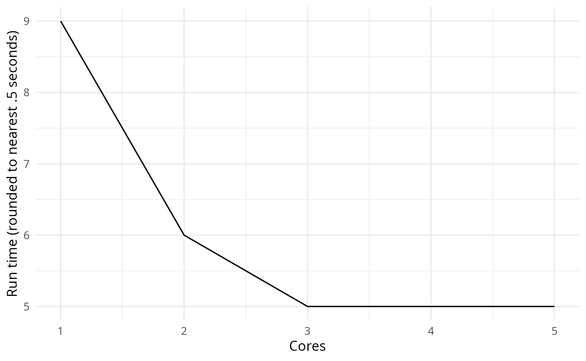
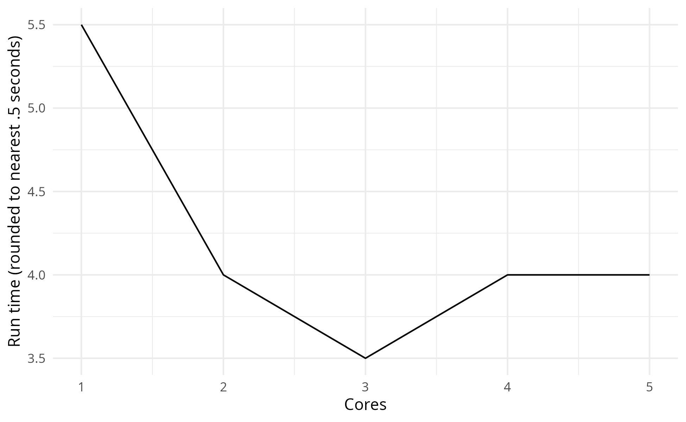

Choosing parameters
================
Amy Heather
2025-01-27

- [Set up](#set-up)
- [Choosing the number of
  replications](#choosing-the-number-of-replications)
- [Run time with varying number of CPU
  cores](#run-time-with-varying-number-of-cpu-cores)
- [Run time](#run-time)

This notebook documents the choice of simulation parameters including:

- Number of replications
- Number of CPU cores

The generated images are saved and then loaded, so that we view the
image as saved (i.e. with the dimensions set in `ggsave()`). This also
avoids the creation of a `_files/` directory when knitting the document
(which would save all previewed images into that folder also, so they
can be rendered and displayed within the output `.md` file, even if we
had not specifically saved them). These are viewed using
`include_graphics()`, which must be the last command in the cell (or
last in the plotting function).

The run time is provided at the end of the notebook.

## Set up

Install the latest version of the local simulation package.

``` r
devtools::install()
```

    ## 
    ## ── R CMD build ─────────────────────────────────────────────────────────────────
    ##      checking for file ‘/home/amy/Documents/stars/rap_template_r_des/DESCRIPTION’ ...  ✔  checking for file ‘/home/amy/Documents/stars/rap_template_r_des/DESCRIPTION’
    ##   ─  preparing ‘simulation’:
    ##    checking DESCRIPTION meta-information ...  ✔  checking DESCRIPTION meta-information
    ##   ─  checking for LF line-endings in source and make files and shell scripts
    ## ─  checking for empty or unneeded directories
    ##      Removed empty directory ‘simulation/tests/testthat/_snaps’
    ##    Omitted ‘LazyData’ from DESCRIPTION
    ##   ─  building ‘simulation_0.1.0.tar.gz’
    ##      
    ## Running /opt/R/4.4.1/lib/R/bin/R CMD INSTALL \
    ##   /tmp/RtmpETGOea/simulation_0.1.0.tar.gz --install-tests 
    ## * installing to library ‘/home/amy/.cache/R/renv/library/rap_template_r_des-cd7d6844/linux-ubuntu-noble/R-4.4/x86_64-pc-linux-gnu’
    ## * installing *source* package ‘simulation’ ...
    ## ** using staged installation
    ## ** R
    ## ** tests
    ## ** byte-compile and prepare package for lazy loading
    ## ** help
    ## *** installing help indices
    ## ** building package indices
    ## ** testing if installed package can be loaded from temporary location
    ## ** testing if installed package can be loaded from final location
    ## ** testing if installed package keeps a record of temporary installation path
    ## * DONE (simulation)

Load required packages.

``` r
# nolint start: undesirable_function_linter.
library(data.table)
library(dplyr)
```

    ## 
    ## Attaching package: 'dplyr'

    ## The following objects are masked from 'package:data.table':
    ## 
    ##     between, first, last

    ## The following objects are masked from 'package:stats':
    ## 
    ##     filter, lag

    ## The following objects are masked from 'package:base':
    ## 
    ##     intersect, setdiff, setequal, union

``` r
library(ggplot2)
library(knitr)
library(simulation)
library(tidyr)

options(data.table.summarise.inform = FALSE)
options(dplyr.summarise.inform = FALSE)
# nolint end
```

Start timer.

``` r
start_time <- Sys.time()
```

Define path to outputs folder.

``` r
output_dir <- file.path("..", "outputs")
```

## Choosing the number of replications

The **confidence interval method** can be used to select the number of
replications to run. The more replications you run, the narrower your
confidence interval becomes, leading to a more precise estimate of the
model’s mean performance.

First, you select a desired confidence interval - for example, 95%.
Then, run the model with an increasing number of replications, and
identify the number required to achieve that precision in the estimate
of a given metric - and also, to maintain that precision (as the
intervals may converge or expand again later on).

This method is less useful for values very close to zero - so, for
example, when using utilisation (which ranges from 0 to 1) it is
recommended to multiple values by 100.

When selecting the number of replications you should repeat the analysis
for all performance measures and select the highest value as your number
of replications.

``` r
#' Use the confidence interval method to select the number of replications.
#'
#' @param replications Number of times to run the model.
#' @param desired_precision Desired mean deviation from confidence interval.
#' @param metric Name of performance metric to assess.
#' @param yaxis_title Label for y axis.
#' @param path Path inc. filename to save figure to.
#' @param min_rep A suggested minimum number of replications (default=NULL).

confidence_interval_method <- function(replications, desired_precision, metric,
                                       yaxis_title, path, min_rep = NULL) {
  # Run model for specified number of replications
  param_class <- defaults()
  param_class[["update"]](list(number_of_runs = replications))
  envs <- trial(param_class)
  results <- process_replications(envs)

  # If mean of metric is less than 1, multiply by 100
  if (mean(results[[metric]]) < 1L) {
    results[[paste0("adj_", metric)]] <- results[[metric]] * 100L
    metric <- paste0("adj_", metric)
  }

  # Initialise list to store the results
  cumulative_list <- list()

  # For each row in the dataframe, filter to rows up to the i-th replication
  # then perform calculations
  for (i in 1L:replications) {

    # Filter rows up to the i-th replication
    subset <- results[[metric]][1L:i]

    # Calculate mean
    mean <- mean(subset)

    # Some calculations require more than 1 observation else will error...
    if (i == 1L) {
      # When only one observation, set to NA
      std_dev <- NA
      ci_lower <- NA
      ci_upper <- NA
      deviation <- NA
    } else {
      # Else, calculate standard deviation, 95% confidence interval, and
      # percentage deviation
      std_dev <- sd(subset)
      ci <- t.test(subset)[["conf.int"]]
      ci_lower <- ci[[1L]]
      ci_upper <- ci[[2L]]
      deviation <- ((ci_upper - mean) / mean) * 100L
    }

    # Append to the cumulative list
    cumulative_list[[i]] <- data.frame(
      replications = i,
      cumulative_mean = mean,
      cumulative_std = std_dev,
      ci_lower = ci_lower,
      ci_upper = ci_upper,
      perc_deviation = deviation
    )
  }

  # Combine the list into a single data frame
  cumulative <- do.call(rbind, cumulative_list)

  # Get the minimum number of replications where deviation is less than target
  compare <- cumulative %>%
    filter(.data[["perc_deviation"]] <= desired_precision * 100L)
  if (nrow(compare) > 0L) {
    # Get minimum number
    n_reps <- compare %>%
      slice_head() %>%
      dplyr::select(replications) %>%
      pull()
    print(paste0("Reached desired precision (", desired_precision, ") in ",
                 n_reps, " replications."))
  } else {
    warning("Running ", replications, " replications did not reach ",
            "desired precision (", desired_precision, ").")
  }
  
  # Plot the cumulative mean and confidence interval
  p <- ggplot(cumulative, aes(x = .data[["replications"]],
                              y = .data[["cumulative_mean"]])) +
    geom_line() +
    geom_ribbon(aes(ymin = ci_lower, ymax = ci_upper), alpha = 0.2)

  # If specified, plot the minimum suggested number of replications
  if (!is.null(min_rep)) {
    p <- p +
      geom_vline(xintercept = min_rep, linetype = "dashed", color = "red")
  }

  # Modify labels and style
  p <- p +
    labs(x = "Replications", y = yaxis_title) +
    theme_minimal()

  # Save the plot
  ggsave(filename = path, width = 6.5, height = 4L, bg = "white")
  
  return(cumulative)
}
```

It’s important to check ahead, to check that the 5% precision is
maintained - which is fine in this case - it doesn’t go back up to
future deviation.

``` r
path <- file.path(output_dir, "choose_param_conf_int_1.png")

# Run calculations and produce plot
ci_df <- confidence_interval_method(
  replications = 150L,
  desired_precision = 0.05,
  metric = "mean_activity_time_nurse",
  yaxis_title = "Mean time with nurse",
  path = path,
  min_rep = 98L
)
```

    ## [1] "Reached desired precision (0.05) in 98 replications."

``` r
# View first ten rows were percentage deviation is below 5
ci_df %>%
  filter(perc_deviation < 5) %>%
  head(10)
```

    ##    replications cumulative_mean cumulative_std ci_lower ci_upper perc_deviation
    ## 1            98        8.461235       2.106669 8.038875 8.883596       4.991712
    ## 2            99        8.475054       2.100398 8.056137 8.893971       4.942943
    ## 3           100        8.468351       2.090838 8.053483 8.883219       4.899036
    ## 4           101        8.473309       2.080954 8.062503 8.884115       4.848241
    ## 5           102        8.478815       2.071373 8.071959 8.885671       4.798504
    ## 6           103        8.485316       2.062250 8.082270 8.888361       4.749915
    ## 7           104        8.490698       2.052949 8.091450 8.889945       4.702173
    ## 8           105        8.477837       2.047301 8.081634 8.874040       4.673399
    ## 9           106        8.456515       2.049320 8.061841 8.851190       4.667105
    ## 10          107        8.459470       2.039859 8.068501 8.850440       4.621677

``` r
# View plot
include_graphics(path)
```

<!-- -->

It is also important to check across multiple metrics.

``` r
path <- file.path(output_dir, "choose_param_conf_int_3.png")

# Run calculations and produce plot
ci_df <- confidence_interval_method(
  replications = 200L,
  desired_precision = 0.05,
  metric = "utilisation_nurse",
  yaxis_title = "Mean nurse utilisation",
  path = path,
  min_rep = 148L
)
```

    ## [1] "Reached desired precision (0.05) in 148 replications."

``` r
# View first ten rows were percentage deviation is below 5
ci_df %>%
  filter(perc_deviation < 5) %>%
  head(10)
```

    ##    replications cumulative_mean cumulative_std ci_lower ci_upper perc_deviation
    ## 1           148        45.73420       14.04814 43.45214 48.01625       4.989822
    ## 2           149        45.89021       14.12952 43.60278 48.17764       4.984574
    ## 3           150        45.90075       14.08261 43.62865 48.17286       4.950028
    ## 4           151        45.84563       14.05193 43.58612 48.10513       4.928512
    ## 5           152        45.92331       14.03803 43.67359 48.17302       4.898849
    ## 6           153        45.84086       14.02890 43.60008 48.08163       4.888154
    ## 7           154        45.71614       14.06836 43.47650 47.95579       4.899034
    ## 8           155        45.85137       14.12331 43.61035 48.09239       4.887567
    ## 9           156        45.87804       14.08162 43.65092 48.10515       4.854423
    ## 10          157        46.12548       14.37477 43.85937 48.39160       4.912928

``` r
# View plot
include_graphics(path)
```

<!-- -->

## Run time with varying number of CPU cores

``` r
#' Run model with varying number of CPU cores and examine run times
#'
#' @param n_cores Number of cores to test up to
#' @param file Filename to save figure to.
#' @param model_param List of parameters for the model.

run_cores <- function(n_cores, file, model_param = NULL) {
  # Run model with 1 to 8 cores
  speed <- list()
  for (i in 1L:n_cores){
    print(paste("Running with cores:", i))
    cores_start <- Sys.time()

    # Run model with specified number of cores
    # If specified, also set to provided model parameters
    param_class <- defaults()
    if (!is.null(model_param)) {
      param_class[["update"]](model_param)
    }
    param_class[["update"]](list(cores = i))
    invisible(trial(param_class))

    # Record time taken
    cores_time <- as.numeric(Sys.time() - cores_start, units = "secs")
    speed[[i]] <- list(cores = i, run_time = round(cores_time, 3L))
  }

  # Convert to dataframe
  speed_df <- rbindlist(speed)

  # Generate plot
  p <- ggplot(speed_df, aes(x = .data[["cores"]], y = .data[["run_time"]])) +
    geom_line() +
    labs(x = "Cores", y = "Run time (seconds)") +
    theme_minimal()

  # Save plot
  full_path <- file.path(output_dir, file)
  ggsave(filename = full_path, plot = p,
         width = 6.5, height = 4L, bg = "white")

  # View the plot
  include_graphics(full_path)
}
```

Setting up and managing a parallel cluster takes extra time. For small
tasks or few iterations, this extra time can be more than the time saved
by running in parallel.

``` r
run_cores(5, "cores1.png")
```

    ## [1] "Running with cores: 1"
    ## [1] "Running with cores: 2"
    ## [1] "Running with cores: 3"
    ## [1] "Running with cores: 4"
    ## [1] "Running with cores: 5"

<!-- -->

Having increased the simulation length, we now see that parallelisation
is decreasing the model run time.

However, when you use more cores, the data needs to be divided and sent
to more workers. For small tasks, this extra work is small, but as the
number of workers increases, the time spent managing and communicating
with them can grow too much. At some point, this overhead becomes larger
than the time saved by using more cores.

The optimal number of cores will vary depending on your model parameters
and machine.

``` r
run_cores(5, "cores2.png", list(data_collection_period = 100000L))
```

    ## [1] "Running with cores: 1"
    ## [1] "Running with cores: 2"
    ## [1] "Running with cores: 3"
    ## [1] "Running with cores: 4"
    ## [1] "Running with cores: 5"

<!-- -->

## Run time

``` r
# Get run time in seconds
end_time <- Sys.time()
runtime <- as.numeric(end_time - start_time, units = "secs")

# Display converted to minutes and seconds
minutes <- as.integer(runtime / 60L)
seconds <- as.integer(runtime %% 60L)
print(sprintf("Notebook run time: %dm %ds", minutes, seconds))
```

    ## [1] "Notebook run time: 1m 18s"
