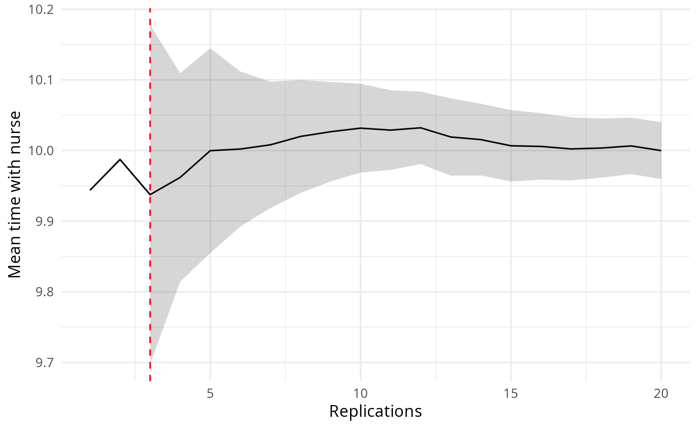
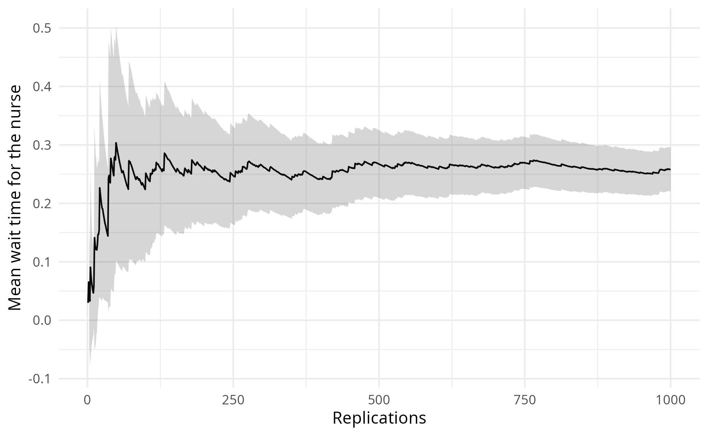
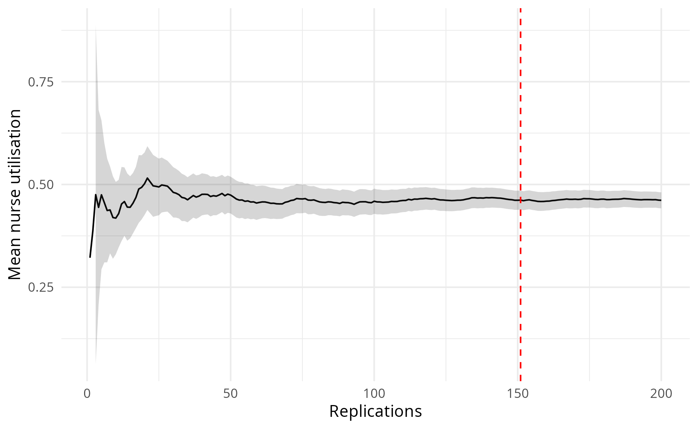
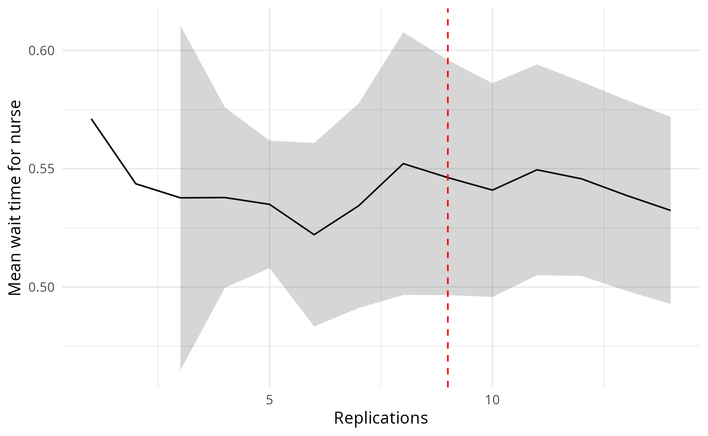
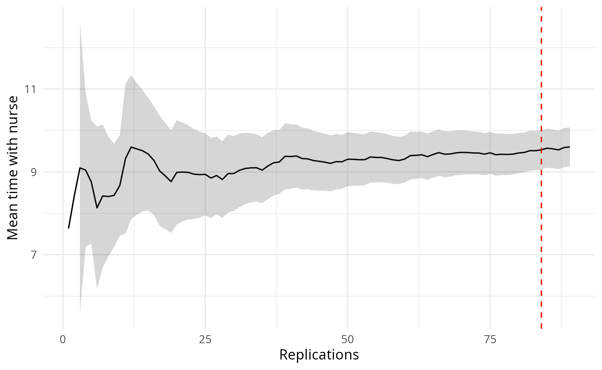
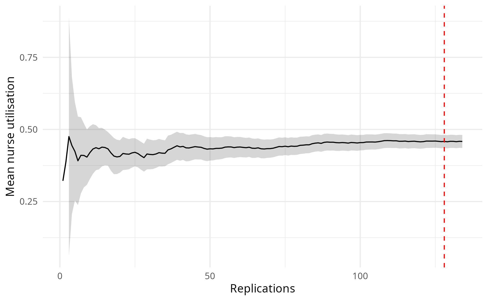

Choosing replications
================
Amy Heather
2025-07-31

- [Set up](#set-up)
- [Choosing the number of
  replications](#choosing-the-number-of-replications)
- [Automated detection of the number of
  replications](#automated-detection-of-the-number-of-replications)
- [Explanation of the automated
  method](#explanation-of-the-automated-method)
  - [WelfordStats](#welfordstats)
  - [ReplicationTabuliser](#replicationtabuliser)
  - [ReplicationsAlgorithm](#replicationsalgorithm)
- [Run time](#run-time)

This notebook documents the choice of the number of replications.

The generated images are saved and then loaded, so that we view the
image as saved (i.e. with the dimensions set in `ggsave()`). This also
avoids the creation of a `_files/` directory when knitting the document
(which would save all previewed images into that folder also, so they
can be rendered and displayed within the output `.md` file, even if we
had not specifically saved them). These are viewed using
`include_graphics()`, which must be the last command in the cell (or
last in the plotting function).

Some of these figures are used in the paper (`mock_paper.md`) - see
below:

- **Figure C.1:** `outputs/reps_algorithm_wait_time.png`
- **Figure C.2:** `outputs/reps_algorithm_serve_time.png`
- **Figure C.3:** `outputs/reps_algorithm_utilisation.png`

The run time is provided at the end of the notebook.

## Set up

Install the latest version of the local simulation package. If running
sequentially, `devtools::load_all()` is sufficient. If running in
parallel, you must use `devtools::install()` and then
`library(simulation)`.

``` r
devtools::load_all()
```

    ## ℹ Loading simulation

Load required packages.

``` r
# nolint start: undesirable_function_linter.
library(data.table)
library(dplyr)
```

    ## 
    ## Attaching package: 'dplyr'

    ## The following objects are masked from 'package:data.table':
    ## 
    ##     between, first, last

    ## The following object is masked from 'package:testthat':
    ## 
    ##     matches

    ## The following objects are masked from 'package:stats':
    ## 
    ##     filter, lag

    ## The following objects are masked from 'package:base':
    ## 
    ##     intersect, setdiff, setequal, union

``` r
library(knitr)
library(tidyr)
```

    ## 
    ## Attaching package: 'tidyr'

    ## The following object is masked from 'package:testthat':
    ## 
    ##     matches

``` r
options(data.table.summarise.inform = FALSE)
options(dplyr.summarise.inform = FALSE)
# nolint end
```

Start timer.

``` r
start_time <- Sys.time()
```

Define path to outputs folder.

``` r
output_dir <- file.path("..", "outputs")
```

## Choosing the number of replications

The **confidence interval method** can help you decide how many
replications (runs) your simulation needs. The more replications you
run, the narrower your confidence interval becomes, leading to a more
precise estimate of the model’s mean performance.

There are two main calculations:

- **Confidence interval**. This is the range where the true mean is
  likely to be, based on your simulation results. For example, a 95%
  confidence interval means that, if you repeated the experiment many
  times, about 95 out of 100 intervals would contain the true mean.
- **Precision**. This tells you how close that range is to your mean.
  For example, if your mean is 50 and your 95% confidence interval is 45
  to 55, your precision is ±10% (because 5 is 10% of 50).

To run this method you:

- Run the model with more and more replications.
- Check after each how wide your confidence interval is.
- Stop when the interval is narrow enough to meet your desired
  precision.
- Make sure the interval stays this narrow if you keep running more
  replications.

This method is less useful for values very close to zero - so, for
example, when using utilisation (which ranges from 0 to 1) it is
recommended to multiple values by 100.

When deciding how many replications you need, repeat this process for
each performance measure you care about, and use the largest number you
find.

It’s important to check ahead, to check that the 10% precision is
maintained - which is fine in this case - it doesn’t go back up to
future deviation.

``` r
# Run calculations and produce plot
ci_df <- confidence_interval_method(
  replications = 20L,
  desired_precision = 0.1,
  metric = "mean_serve_time_nurse"
)
```

    ## $patient_inter
    ## [1] 4
    ## 
    ## $mean_n_consult_time
    ## [1] 10
    ## 
    ## $number_of_nurses
    ## [1] 5
    ## 
    ## $warm_up_period
    ## [1] 38880
    ## 
    ## $data_collection_period
    ## [1] 43200
    ## 
    ## $number_of_runs
    ## [1] 20
    ## 
    ## $scenario_name
    ## NULL
    ## 
    ## $cores
    ## [1] 1
    ## 
    ## $log_to_console
    ## [1] FALSE
    ## 
    ## $log_to_file
    ## [1] FALSE
    ## 
    ## $file_path
    ## NULL

    ## Reached desired precision (0.1) in 3 replications.

``` r
# Preview dataframe
head(ci_df)
```

    ##   replications      data cumulative_mean      stdev lower_ci upper_ci
    ## 1            1  9.943731        9.943731         NA       NA       NA
    ## 2            2 10.030844        9.987287         NA       NA       NA
    ## 3            3  9.837930        9.937501 0.09660777 9.697514 10.17749
    ## 4            4 10.035143        9.961912 0.09276587 9.814301 10.10952
    ## 5            5 10.151207        9.999771 0.11670760 9.854859 10.14468
    ## 6            6 10.013713       10.002095 0.10454153 9.892385 10.11180
    ##    deviation                metric
    ## 1         NA mean_serve_time_nurse
    ## 2         NA mean_serve_time_nurse
    ## 3 0.02414963 mean_serve_time_nurse
    ## 4 0.01481756 mean_serve_time_nurse
    ## 5 0.01449149 mean_serve_time_nurse
    ## 6 0.01096866 mean_serve_time_nurse

``` r
# View first ten rows where percentage deviation is below 5
ci_df |>
  filter(deviation < 0.05) |>
  head(10L)
```

    ##    replications     data cumulative_mean      stdev lower_ci upper_ci
    ## 1             3  9.83793        9.937501 0.09660777 9.697514 10.17749
    ## 2             4 10.03514        9.961912 0.09276587 9.814301 10.10952
    ## 3             5 10.15121        9.999771 0.11670760 9.854859 10.14468
    ## 4             6 10.01371       10.002095 0.10454153 9.892385 10.11180
    ## 5             7 10.04365       10.008030 0.09671647 9.918583 10.09748
    ## 6             8 10.10287       10.019885 0.09561401 9.939950 10.09982
    ## 7             9 10.08016       10.026582 0.09166773 9.956120 10.09704
    ## 8            10 10.07725       10.031649 0.08789805 9.968771 10.09453
    ## 9            11 10.00108       10.028870 0.08389535 9.972509 10.08523
    ## 10           12 10.06799       10.032131 0.08078447 9.980803 10.08346
    ##      deviation                metric
    ## 1  0.024149633 mean_serve_time_nurse
    ## 2  0.014817557 mean_serve_time_nurse
    ## 3  0.014491495 mean_serve_time_nurse
    ## 4  0.010968663 mean_serve_time_nurse
    ## 5  0.008937605 mean_serve_time_nurse
    ## 6  0.007977668 mean_serve_time_nurse
    ## 7  0.007027525 mean_serve_time_nurse
    ## 8  0.006268010 mean_serve_time_nurse
    ## 9  0.005619941 mean_serve_time_nurse
    ## 10 0.005116361 mean_serve_time_nurse

``` r
# Create plot
path <- file.path(output_dir, "conf_int_method_serve_time.png")
plot_replication_ci(
  conf_ints = ci_df,
  yaxis_title = "Mean time with nurse",
  file_path = path,
  min_rep = 3L
)
# View plot
include_graphics(path)
```

<!-- -->

It is also important to check across multiple metrics.

``` r
# Run calculations
ci_df <- confidence_interval_method(
  replications = 20L,
  desired_precision = 0.1,
  metric = "mean_waiting_time_nurse"
)
```

    ## $patient_inter
    ## [1] 4
    ## 
    ## $mean_n_consult_time
    ## [1] 10
    ## 
    ## $number_of_nurses
    ## [1] 5
    ## 
    ## $warm_up_period
    ## [1] 38880
    ## 
    ## $data_collection_period
    ## [1] 43200
    ## 
    ## $number_of_runs
    ## [1] 20
    ## 
    ## $scenario_name
    ## NULL
    ## 
    ## $cores
    ## [1] 1
    ## 
    ## $log_to_console
    ## [1] FALSE
    ## 
    ## $log_to_file
    ## [1] FALSE
    ## 
    ## $file_path
    ## NULL

    ## Reached desired precision (0.1) in 4 replications.

``` r
# Preview dataframe
tail(ci_df)
```

    ##    replications      data cumulative_mean      stdev  lower_ci  upper_ci
    ## 15           15 0.4970082       0.5299692 0.06659604 0.4930895 0.5668489
    ## 16           16 0.5398594       0.5305873 0.06438539 0.4962788 0.5648959
    ## 17           17 0.4826912       0.5277699 0.06341395 0.4951655 0.5603744
    ## 18           18 0.5372420       0.5282962 0.06156107 0.4976826 0.5589097
    ## 19           19 0.4573923       0.5245644 0.06199855 0.4946820 0.5544467
    ## 20           20 0.4967360       0.5231730 0.06066493 0.4947809 0.5515650
    ##     deviation                  metric
    ## 15 0.06958831 mean_waiting_time_nurse
    ## 16 0.06466146 mean_waiting_time_nurse
    ## 17 0.06177776 mean_waiting_time_nurse
    ## 18 0.05794780 mean_waiting_time_nurse
    ## 19 0.05696602 mean_waiting_time_nurse
    ## 20 0.05426898 mean_waiting_time_nurse

``` r
# Create plot
path <- file.path(output_dir, "conf_int_method_wait_time.png")
plot_replication_ci(
  conf_ints = ci_df,
  yaxis_title = "Mean wait time for the nurse",
  file_path = path,
  min_rep = 4L
)
# View plot
include_graphics(path)
```

<!-- -->

``` r
# Run calculations
ci_df <- confidence_interval_method(
  replications = 20L,
  desired_precision = 0.1,
  metric = "utilisation_nurse"
)
```

    ## $patient_inter
    ## [1] 4
    ## 
    ## $mean_n_consult_time
    ## [1] 10
    ## 
    ## $number_of_nurses
    ## [1] 5
    ## 
    ## $warm_up_period
    ## [1] 38880
    ## 
    ## $data_collection_period
    ## [1] 43200
    ## 
    ## $number_of_runs
    ## [1] 20
    ## 
    ## $scenario_name
    ## NULL
    ## 
    ## $cores
    ## [1] 1
    ## 
    ## $log_to_console
    ## [1] FALSE
    ## 
    ## $log_to_file
    ## [1] FALSE
    ## 
    ## $file_path
    ## NULL

    ## Reached desired precision (0.1) in 3 replications.

``` r
# Preview dataframe
head(ci_df)
```

    ##   replications      data cumulative_mean       stdev  lower_ci  upper_ci
    ## 1            1 0.4967536       0.4967536          NA        NA        NA
    ## 2            2 0.4992264       0.4979900          NA        NA        NA
    ## 3            3 0.4908188       0.4955996 0.004320968 0.4848657 0.5063335
    ## 4            4 0.5038593       0.4976645 0.005431675 0.4890215 0.5063075
    ## 5            5 0.5017555       0.4984827 0.005047227 0.4922158 0.5047497
    ## 6            6 0.5060808       0.4997491 0.005477344 0.4940009 0.5054972
    ##    deviation            metric
    ## 1         NA utilisation_nurse
    ## 2         NA utilisation_nurse
    ## 3 0.02165837 utilisation_nurse
    ## 4 0.01736714 utilisation_nurse
    ## 5 0.01257207 utilisation_nurse
    ## 6 0.01150201 utilisation_nurse

``` r
# Create plot
path <- file.path(output_dir, "conf_int_method_utilisation.png")
plot_replication_ci(
  conf_ints = ci_df,
  yaxis_title = "Mean nurse utilisation",
  file_path = path,
  min_rep = 3L
)
# View plot
include_graphics(path)
```

<!-- -->

## Automated detection of the number of replications

Run the algorithm (which will run model with increasing reps) for a few
different metrics.

``` r
# Set up and run algorithm
alg <- ReplicationsAlgorithm$new(param = parameters())
```

    ## [1] "Model parameters:"
    ## $patient_inter
    ## [1] 4
    ## 
    ## $mean_n_consult_time
    ## [1] 10
    ## 
    ## $number_of_nurses
    ## [1] 5
    ## 
    ## $warm_up_period
    ## [1] 38880
    ## 
    ## $data_collection_period
    ## [1] 43200
    ## 
    ## $number_of_runs
    ## [1] 31
    ## 
    ## $scenario_name
    ## NULL
    ## 
    ## $cores
    ## [1] 1
    ## 
    ## $log_to_console
    ## [1] FALSE
    ## 
    ## $log_to_file
    ## [1] FALSE
    ## 
    ## $file_path
    ## NULL

``` r
alg$select()
```

``` r
# View results
alg$nreps
```

    ## $mean_waiting_time_nurse
    ## [1] 9
    ## 
    ## $mean_serve_time_nurse
    ## [1] 3
    ## 
    ## $utilisation_nurse
    ## [1] 3

``` r
alg$summary_table
```

    ##    replications       data cumulative_mean       stdev  lower_ci   upper_ci
    ## 1             1  0.5710589       0.5710589          NA        NA         NA
    ## 2             2  0.5161697       0.5436143          NA        NA         NA
    ## 3             3  0.5257707       0.5376664 0.029314456 0.4648453  0.6104876
    ## 4             4  0.5381486       0.5377870 0.023936367 0.4996989  0.5758751
    ## 5             5  0.5234430       0.5349182 0.021699356 0.5079749  0.5618615
    ## 6             6  0.4579594       0.5220917 0.036929630 0.4833365  0.5608470
    ## 7             7  0.6077136       0.5343234 0.046731144 0.4911043  0.5775425
    ## 8             8  0.6767519       0.5521270 0.066389484 0.4966240  0.6076300
    ## 9             9  0.4988971       0.5462126 0.064586709 0.4965668  0.5958583
    ## 10           10  0.4934531       0.5409366 0.063137198 0.4957710  0.5861022
    ## 11           11  0.6352630       0.5495117 0.066306383 0.5049665  0.5940570
    ## 12           12  0.5037119       0.5456951 0.064588338 0.5046576  0.5867326
    ## 13           13  0.4551971       0.5387337 0.066738344 0.4984041  0.5790633
    ## 14           14  0.4489918       0.5323236 0.068459102 0.4927965  0.5718507
    ## 15            1  9.9437308       9.9437308          NA        NA         NA
    ## 16            2 10.0308438       9.9872873          NA        NA         NA
    ## 17            3  9.8379297       9.9375014 0.096607773 9.6975144 10.1774884
    ## 18            4 10.0351429       9.9619118 0.092765866 9.8143006 10.1095230
    ## 19            5 10.1512070       9.9997708 0.116707602 9.8548592 10.1446824
    ## 20            6 10.0137134      10.0020946 0.104541526 9.8923850 10.1118042
    ## 21            7 10.0436450      10.0080304 0.096716474 9.9185825 10.0974782
    ## 22            8 10.1028675      10.0198850 0.095614011 9.9399497 10.0998203
    ## 23            1  0.4967536       0.4967536          NA        NA         NA
    ## 24            2  0.4992264       0.4979900          NA        NA         NA
    ## 25            3  0.4908188       0.4955996 0.004320968 0.4848657  0.5063335
    ## 26            4  0.5038593       0.4976645 0.005431675 0.4890215  0.5063075
    ## 27            5  0.5017555       0.4984827 0.005047227 0.4922158  0.5047497
    ## 28            6  0.5060808       0.4997491 0.005477344 0.4940009  0.5054972
    ## 29            7  0.5081200       0.5009449 0.005917056 0.4954725  0.5064173
    ## 30            8  0.5050496       0.5014580 0.005667093 0.4967202  0.5061958
    ##      deviation                  metric
    ## 1           NA mean_waiting_time_nurse
    ## 2           NA mean_waiting_time_nurse
    ## 3  0.135439266 mean_waiting_time_nurse
    ## 4  0.070823772 mean_waiting_time_nurse
    ## 5  0.050369028 mean_waiting_time_nurse
    ## 6  0.074230768 mean_waiting_time_nurse
    ## 7  0.080885654 mean_waiting_time_nurse
    ## 8  0.100525782 mean_waiting_time_nurse
    ## 9  0.090890878 mean_waiting_time_nurse
    ## 10 0.083495238 mean_waiting_time_nurse
    ## 11 0.081063300 mean_waiting_time_nurse
    ## 12 0.075202202 mean_waiting_time_nurse
    ## 13 0.074859950 mean_waiting_time_nurse
    ## 14 0.074253914 mean_waiting_time_nurse
    ## 15          NA   mean_serve_time_nurse
    ## 16          NA   mean_serve_time_nurse
    ## 17 0.024149633   mean_serve_time_nurse
    ## 18 0.014817557   mean_serve_time_nurse
    ## 19 0.014491495   mean_serve_time_nurse
    ## 20 0.010968663   mean_serve_time_nurse
    ## 21 0.008937605   mean_serve_time_nurse
    ## 22 0.007977668   mean_serve_time_nurse
    ## 23          NA       utilisation_nurse
    ## 24          NA       utilisation_nurse
    ## 25 0.021658371       utilisation_nurse
    ## 26 0.017367136       utilisation_nurse
    ## 27 0.012572072       utilisation_nurse
    ## 28 0.011502014       utilisation_nurse
    ## 29 0.010924084       utilisation_nurse
    ## 30 0.009448066       utilisation_nurse

Visualise results for each metric…

``` r
path <- file.path(output_dir, "reps_algorithm_wait_time.png")
plot_replication_ci(
  conf_ints = filter(alg$summary_table, metric == "mean_waiting_time_nurse"),
  yaxis_title = "Mean wait time for nurse",
  file_path = path,
  min_rep = alg$nreps[["mean_waiting_time_nurse"]]
)
include_graphics(path)
```

<!-- -->

``` r
path <- file.path(output_dir, "reps_algorithm_serve_time.png")
plot_replication_ci(
  conf_ints = filter(alg$summary_table, metric == "mean_serve_time_nurse"),
  yaxis_title = "Mean time with nurse",
  file_path = path,
  min_rep = alg$nreps[["mean_serve_time_nurse"]]
)
include_graphics(path)
```

<!-- -->

``` r
path <- file.path(output_dir, "reps_algorithm_utilisation.png")
plot_replication_ci(
  conf_ints = filter(alg$summary_table, metric == "utilisation_nurse"),
  yaxis_title = "Mean nurse utilisation",
  file_path = path,
  min_rep = alg$nreps[["utilisation_nurse"]]
)
include_graphics(path)
```

<!-- -->

## Explanation of the automated method

This section walks through how the automation code is structured. The
algorithm that determines the number of replications is
`ReplicationsAlgorithm`. This depends on other R6 classes including
`WelfordStats` and `ReplicationTabuliser`.

### WelfordStats

`WelfordStats` is designed to:

- Keep a **running mean and sum of squares**.
- Return **other statistics** based on these (e.g. standard deviation,
  confidence intervals).
- **Call the `update()`** method of `ReplicationTabuliser` whenever a
  new data point is processed by `WelfordStats`

#### How do the running mean and sum of squares calculations work?

The running mean and sum of squares are updated iteratively with each
new data point provided, **without requiring the storage of all previous
data points**. This approach can be referred to as “online” because we
only need to store a small set of values (such as the current mean and
sum of squares), rather than maintaining an entire list of past values.

For example, focusing on the mean, normally you would need to store all
the data points in a list and sum them up to compute the average - for
example:

    data_points <- c(1, 2, 3, 4, 5)
    mean <- sum(data_points) / length(data_points)

This works fine for small datasets, but as the data grows, maintaining
the entire list becomes impractical. Instead, we can update the mean
without storing the previous data points using **Welford’s online
algorithm**. The formula for the running mean is:

$$
\mu_n = \mu_{n-1} + \frac{x_n - \mu_{n-1}}{n}
$$

Where:

- $\mu_n$ is the running mean after the $n$-th data point.
- $x_n$ is the new data point.
- $\mu_{n-1}$ is the running mean before the new data point.

The key thing to notice here is that, to update the mean, **all we
needed to know was the current running mean, the new data point, and the
number of data points**. A similar formula exists for calculating the
sum of squares.

In our code, every time we call `update()` with a new data point, the
mean and sum of squares are adjusted, with `n` keeping track of the
number of data points so far - for example:

    WelfordStats <- R6Class("WelfordStats", list( # nolint: object_name_linter

      n = 0L,
      mean = NA,
      ...

      update = function(x) {
        self$n <- self$n + 1L
        ...
          updated_mean <- self$mean + ((x - self$mean) / self$n)
          ...
          self$mean <- updated_meam
          ...

#### What other statistics can it calculate?

`WelfordStats` then has a series of methods which can return other
statistics based on the current mean, sum of squares, and count:

- Variance
- Standard deviation
- Standard error
- Half width of the confidence interval
- Lower confidence interval bound
- Upper confidence interval bound
- Deviation of confidence interval from the mean

### ReplicationTabuliser

`ReplicationTabuliser` keeps track of our results. It:

- Stores **lists with various statistics**, which are updated whenever
  `update()` is called.
- Can convert these into a **dataframe** using the `summary_table()`
  method.

<figure>

<figcaption aria-hidden="true">Interaction between WelfordStats and
ReplicationTabuliser</figcaption>
</figure>

### ReplicationsAlgorithm

The diagram below is a visual representation of the logic in the
**ReplicationsAlgorithm**.

Once set up with the relevant parameters, it will first check if there
are **initial_replications** to run. These might be specified if the
user knows that the model will need at least X amount of replications
before any metrics start to get close to the desired precision. The
benefit of specifying these is that they are run using **runner()** and
so can be run in parallel if chosen.

Once these are run, it checks if any metrics meet precision already.
Typically more replications will be required (for the length of the
lookahead period) - but if there is no lookahead, they can be marked as
solved.

> **What is the lookahead period?**
>
> We want to make sure that the desired precision is stable and
> maintained for several replications. Here, we refer to this as the
> lookahead period.
>
> The user will specify **look_ahead** - as noted in
> [sim-tools](https://tommonks.github.io/sim-tools/04_replications/01_automated_reps.html),
> this is recommended to be **5** by [Hoad et
> al. (2010)](https://www.jstor.org/stable/40926090).
>
> The algorithm contains a method **klimit()** which will scale up the
> lookahead if more than 100 replications have been run, to ensure a
> sufficient period is being checked for stability, relative to the
> number of replications. This is simply:
> `look_ahead/100 * replications`. For example, if we have run 200
> replications and look_ahead is 5: `5/100 * 200 = 10`.

After any initial replications, the algorithm enters a while loop. This
continues until all metrics are solved or the number of replications
surpasses the user-specified **replication_budget** - whichever comes
first!

With each loop, it runs the model for another replication, then updates
the results for any unsolved metrics from this replication, and checks
if precision is met. The **target_met** is a record of how many times in
a row precision has been met - once this passes the lookahead period,
the metric is marked as solved.

<figure>

<figcaption aria-hidden="true">Visual representation of logic in
ReplicationsAlgorithm</figcaption>
</figure>

## Run time

``` r
# Get run time in seconds
end_time <- Sys.time()
runtime <- as.numeric(end_time - start_time, units = "secs")

# Display converted to minutes and seconds
minutes <- as.integer(runtime / 60L)
seconds <- as.integer(runtime %% 60L)
cat(sprintf("Notebook run time: %dm %ds", minutes, seconds))
```

    ## Notebook run time: 0m 41s
