Choosing replications
================
Amy Heather
2025-11-10

- [Set up](#set-up)
- [Choosing the number of
  replications](#choosing-the-number-of-replications)
- [Automated detection of the number of
  replications](#automated-detection-of-the-number-of-replications)
- [Sensitivity analysis: running algorithm with seed
  offset](#sensitivity-analysis-running-algorithm-with-seed-offset)
- [Chosen number of replications](#chosen-number-of-replications)
- [Explanation of the automated
  method](#explanation-of-the-automated-method)
  - [WelfordStats](#welfordstats)
  - [ReplicationTabuliser](#replicationtabuliser)
  - [ReplicationsAlgorithm](#replicationsalgorithm)
- [Run time](#run-time)

This notebook documents the choice of the number of replications.

The generated images are saved and then loaded, so that we view the
image as saved (i.e. with the dimensions set in `ggsave()`). This also
avoids the creation of a `_files/` directory when knitting the document
(which would save all previewed images into that folder also, so they
can be rendered and displayed within the output `.md` file, even if we
had not specifically saved them). These are viewed using
`include_graphics()`, which must be the last command in the cell (or
last in the plotting function).

Some of these figures are used in the paper (`mock_paper.md`) - see
below:

- **Figure C.1:** `outputs/reps_algorithm_wait_time.png`
- **Figure C.2:** `outputs/reps_algorithm_serve_time.png`
- **Figure C.3:** `outputs/reps_algorithm_utilisation.png`

The run time is provided at the end of the notebook.

## Set up

Install the latest version of the local simulation package. If running
sequentially, `devtools::load_all()` is sufficient. If running in
parallel, you must use `devtools::install()` and then
`library(simulation)`.

``` r
devtools::load_all()
```

    ## ℹ Loading simulation

Load required packages.

``` r
# nolint start: undesirable_function_linter.
library(data.table)
library(dplyr)
```

    ## 
    ## Attaching package: 'dplyr'

    ## The following objects are masked from 'package:data.table':
    ## 
    ##     between, first, last

    ## The following object is masked from 'package:testthat':
    ## 
    ##     matches

    ## The following objects are masked from 'package:stats':
    ## 
    ##     filter, lag

    ## The following objects are masked from 'package:base':
    ## 
    ##     intersect, setdiff, setequal, union

``` r
library(knitr)

options(data.table.summarise.inform = FALSE)
options(dplyr.summarise.inform = FALSE)
# nolint end
```

Start timer.

``` r
start_time <- Sys.time()
```

Define path to outputs folder.

``` r
output_dir <- file.path("..", "outputs")
```

## Choosing the number of replications

The **confidence interval method** can help you decide how many
replications (runs) your simulation needs. The more replications you
run, the narrower your confidence interval becomes, leading to a more
precise estimate of the model’s mean performance.

There are two main calculations:

- **Confidence interval**. This is the range where the true mean is
  likely to be, based on your simulation results. For example, a 95%
  confidence interval means that, if you repeated the experiment many
  times, about 95 out of 100 intervals would contain the true mean.
- **Precision**. This tells you how close that range is to your mean.
  For example, if your mean is 50 and your 95% confidence interval is 45
  to 55, your precision is ±10% (because 5 is 10% of 50).

To run this method you:

- Run the model with more and more replications.
- Check after each how wide your confidence interval is.
- Stop when the interval is narrow enough to meet your desired
  precision.
- Make sure the interval stays this narrow if you keep running more
  replications.

This method is less useful for values very close to zero - so, for
example, when using utilisation (which ranges from 0 to 1) it is
recommended to multiple values by 100.

When deciding how many replications you need, repeat this process for
each performance measure you care about, and use the largest number you
find.

It’s important to check ahead, to check that the 10% precision is
maintained - which is fine in this case - it doesn’t go back up to
future deviation.

``` r
# Run calculations and produce plot
ci_df <- confidence_interval_method(
  replications = 20L,
  desired_precision = 0.1,
  metric = "mean_serve_time_nurse"
)
```

    ## $patient_inter
    ## [1] 4
    ## 
    ## $mean_n_consult_time
    ## [1] 10
    ## 
    ## $number_of_nurses
    ## [1] 5
    ## 
    ## $warm_up_period
    ## [1] 10080
    ## 
    ## $data_collection_period
    ## [1] 20160
    ## 
    ## $number_of_runs
    ## [1] 20
    ## 
    ## $scenario_name
    ## NULL
    ## 
    ## $cores
    ## [1] 1
    ## 
    ## $seed_offset
    ## [1] 0
    ## 
    ## $log_to_console
    ## [1] FALSE
    ## 
    ## $log_to_file
    ## [1] FALSE
    ## 
    ## $file_path
    ## NULL

    ## Reached desired precision (0.1) in 3 replications.

``` r
ci_df
```

    ##    replications      data cumulative_mean     stdev lower_ci upper_ci
    ## 1             1  9.838471        9.838471        NA       NA       NA
    ## 2             2 10.150584        9.994527        NA       NA       NA
    ## 3             3  9.886796        9.958617 0.1679954 9.541293 10.37594
    ## 4             4 10.192953       10.017201 0.1803976 9.730148 10.30425
    ## 5             5 10.078433       10.029447 0.1586107 9.832506 10.22639
    ## 6             6  9.847684        9.999153 0.1601006 9.831138 10.16717
    ## 7             7 10.000492        9.999345 0.1461521 9.864177 10.13451
    ## 8             8 10.117375       10.014099 0.1415993 9.895719 10.13248
    ## 9             9  9.836465        9.994361 0.1450863 9.882838 10.10588
    ## 10           10  9.992309        9.994156 0.1367902 9.896302 10.09201
    ## 11           11  9.996690        9.994387 0.1297728 9.907204 10.08157
    ## 12           12 10.069318       10.000631 0.1256100 9.920822 10.08044
    ## 13           13  9.930993        9.995274 0.1218035 9.921669 10.06888
    ## 14           14 10.010930        9.996392 0.1170998 9.928781 10.06400
    ## 15           15  9.939161        9.992577 0.1138037 9.929555 10.05560
    ## 16           16 10.014721        9.993961 0.1100841 9.935301 10.05262
    ## 17           17  9.905736        9.988771 0.1087150 9.932875 10.04467
    ## 18           18 10.005170        9.989682 0.1055399 9.937198 10.04217
    ## 19           19  9.916638        9.985838 0.1039263 9.935747 10.03593
    ## 20           20  9.903361        9.981714 0.1028219 9.933592 10.02984
    ##      deviation                metric
    ## 1           NA mean_serve_time_nurse
    ## 2           NA mean_serve_time_nurse
    ## 3  0.041905787 mean_serve_time_nurse
    ## 4  0.028655999 mean_serve_time_nurse
    ## 5  0.019636300 mean_serve_time_nurse
    ## 6  0.016802954 mean_serve_time_nurse
    ## 7  0.013517700 mean_serve_time_nurse
    ## 8  0.011821327 mean_serve_time_nurse
    ## 9  0.011158612 mean_serve_time_nurse
    ## 10 0.009791104 mean_serve_time_nurse
    ## 11 0.008723155 mean_serve_time_nurse
    ## 12 0.007980378 mean_serve_time_nurse
    ## 13 0.007363992 mean_serve_time_nurse
    ## 14 0.006763581 mean_serve_time_nurse
    ## 15 0.006306918 mean_serve_time_nurse
    ## 16 0.005869511 mean_serve_time_nurse
    ## 17 0.005595895 mean_serve_time_nurse
    ## 18 0.005253796 mean_serve_time_nurse
    ## 19 0.005016189 mean_serve_time_nurse
    ## 20 0.004821027 mean_serve_time_nurse

``` r
# Create plot
path <- file.path(output_dir, "conf_int_method_serve_time.png")
plot_replication_ci(
  conf_ints = ci_df,
  yaxis_title = "Mean time with nurse",
  file_path = path,
  min_rep = 3L
)
# View plot
include_graphics(path)
```

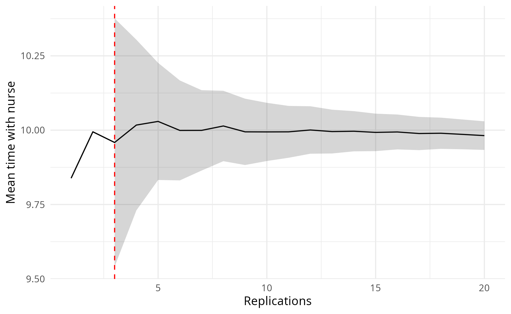<!-- -->

It is also important to check across multiple metrics.

``` r
# Run calculations
ci_df <- confidence_interval_method(
  replications = 20L,
  desired_precision = 0.1,
  metric = "mean_waiting_time_nurse"
)
```

    ## $patient_inter
    ## [1] 4
    ## 
    ## $mean_n_consult_time
    ## [1] 10
    ## 
    ## $number_of_nurses
    ## [1] 5
    ## 
    ## $warm_up_period
    ## [1] 10080
    ## 
    ## $data_collection_period
    ## [1] 20160
    ## 
    ## $number_of_runs
    ## [1] 20
    ## 
    ## $scenario_name
    ## NULL
    ## 
    ## $cores
    ## [1] 1
    ## 
    ## $seed_offset
    ## [1] 0
    ## 
    ## $log_to_console
    ## [1] FALSE
    ## 
    ## $log_to_file
    ## [1] FALSE
    ## 
    ## $file_path
    ## NULL

    ## Reached desired precision (0.1) in 4 replications.

``` r
# Preview dataframe
ci_df
```

    ##    replications      data cumulative_mean      stdev  lower_ci  upper_ci
    ## 1             1 0.4671962       0.4671962         NA        NA        NA
    ## 2             2 0.4671014       0.4671488         NA        NA        NA
    ## 3             3 0.5074186       0.4805720 0.02324980 0.4228163 0.5383278
    ## 4             4 0.4810697       0.4806965 0.01898502 0.4504871 0.5109058
    ## 5             5 0.3934710       0.4632514 0.04233178 0.4106895 0.5158132
    ## 6             6 0.4419879       0.4597075 0.03884507 0.4189421 0.5004728
    ## 7             7 0.7299424       0.4983125 0.10811971 0.3983184 0.5983065
    ## 8             8 0.6664858       0.5193341 0.11642669 0.4219990 0.6166693
    ## 9             9 0.5852518       0.5266583 0.11110162 0.4412580 0.6120586
    ## 10           10 0.4282092       0.5168134 0.10927619 0.4386419 0.5949849
    ## 11           11 0.4958407       0.5149068 0.10386117 0.4451319 0.5846817
    ## 12           12 0.6940603       0.5298362 0.11171910 0.4588533 0.6008192
    ## 13           13 0.4061751       0.5203239 0.11232709 0.4524453 0.5882024
    ## 14           14 0.4663022       0.5164652 0.10888187 0.4535986 0.5793317
    ## 15           15 0.3807618       0.5074183 0.11061713 0.4461606 0.5686760
    ## 16           16 0.4409244       0.5032624 0.10815149 0.4456326 0.5608923
    ## 17           17 0.5017998       0.5031764 0.10471783 0.4493354 0.5570173
    ## 18           18 0.5049785       0.5032765 0.10159211 0.4527559 0.5537971
    ## 19           19 0.5483079       0.5056466 0.09926882 0.4578005 0.5534926
    ## 20           20 0.4775298       0.5042407 0.09682550 0.4589250 0.5495565
    ##     deviation                  metric
    ## 1          NA mean_waiting_time_nurse
    ## 2          NA mean_waiting_time_nurse
    ## 3  0.12018118 mean_waiting_time_nurse
    ## 4  0.06284506 mean_waiting_time_nurse
    ## 5  0.11346290 mean_waiting_time_nurse
    ## 6  0.08867682 mean_waiting_time_nurse
    ## 7  0.20066537 mean_waiting_time_nurse
    ## 8  0.18742298 mean_waiting_time_nurse
    ## 9  0.16215498 mean_waiting_time_nurse
    ## 10 0.15125667 mean_waiting_time_nurse
    ## 11 0.13550974 mean_waiting_time_nurse
    ## 12 0.13397145 mean_waiting_time_nurse
    ## 13 0.13045449 mean_waiting_time_nurse
    ## 14 0.12172460 mean_waiting_time_nurse
    ## 15 0.12072432 mean_waiting_time_nurse
    ## 16 0.11451255 mean_waiting_time_nurse
    ## 17 0.10700213 mean_waiting_time_nurse
    ## 18 0.10038332 mean_waiting_time_nurse
    ## 19 0.09462348 mean_waiting_time_nurse
    ## 20 0.08986924 mean_waiting_time_nurse

``` r
# Create plot
path <- file.path(output_dir, "conf_int_method_wait_time.png")
plot_replication_ci(
  conf_ints = ci_df,
  yaxis_title = "Mean wait time for the nurse",
  file_path = path,
  min_rep = 4L
)
# View plot
include_graphics(path)
```

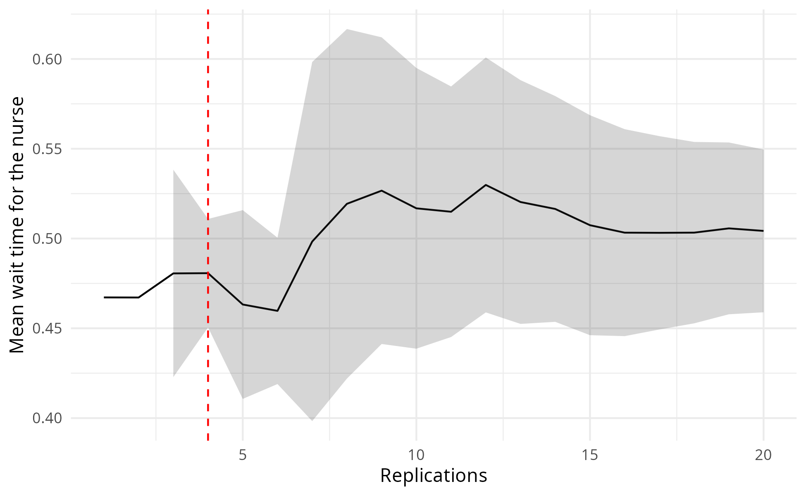<!-- -->

``` r
# Run calculations
ci_df <- confidence_interval_method(
  replications = 20L,
  desired_precision = 0.1,
  metric = "utilisation_nurse"
)
```

    ## $patient_inter
    ## [1] 4
    ## 
    ## $mean_n_consult_time
    ## [1] 10
    ## 
    ## $number_of_nurses
    ## [1] 5
    ## 
    ## $warm_up_period
    ## [1] 10080
    ## 
    ## $data_collection_period
    ## [1] 20160
    ## 
    ## $number_of_runs
    ## [1] 20
    ## 
    ## $scenario_name
    ## NULL
    ## 
    ## $cores
    ## [1] 1
    ## 
    ## $seed_offset
    ## [1] 0
    ## 
    ## $log_to_console
    ## [1] FALSE
    ## 
    ## $log_to_file
    ## [1] FALSE
    ## 
    ## $file_path
    ## NULL

    ## Reached desired precision (0.1) in 3 replications.

``` r
# Preview dataframe
head(ci_df)
```

    ##   replications      data cumulative_mean       stdev  lower_ci  upper_ci
    ## 1            1 0.4919823       0.4919823          NA        NA        NA
    ## 2            2 0.5092291       0.5006057          NA        NA        NA
    ## 3            3 0.4907129       0.4973081 0.010343360 0.4716138 0.5230024
    ## 4            4 0.5100187       0.5004857 0.010569440 0.4836674 0.5173041
    ## 5            5 0.5005043       0.5004895 0.009153408 0.4891240 0.5118549
    ## 6            6 0.4995751       0.5003371 0.008195562 0.4917363 0.5089378
    ##    deviation            metric
    ## 1         NA utilisation_nurse
    ## 2         NA utilisation_nurse
    ## 3 0.05166683 utilisation_nurse
    ## 4 0.03360403 utilisation_nurse
    ## 5 0.02270868 utilisation_nurse
    ## 6 0.01718984 utilisation_nurse

``` r
# Create plot
path <- file.path(output_dir, "conf_int_method_utilisation.png")
plot_replication_ci(
  conf_ints = ci_df,
  yaxis_title = "Mean nurse utilisation",
  file_path = path,
  min_rep = 3L
)
# View plot
include_graphics(path)
```

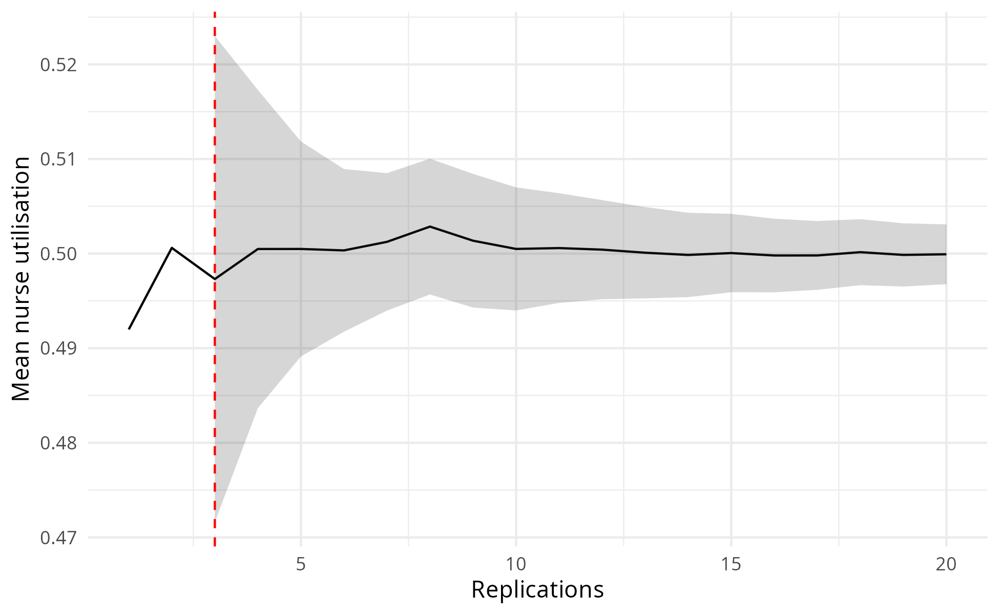<!-- -->

## Automated detection of the number of replications

Run the algorithm (which will run model with increasing reps) for a few
different metrics.

``` r
# Set up and run algorithm
alg <- ReplicationsAlgorithm$new(param = parameters())
```

    ## [1] "Model parameters:"
    ## $patient_inter
    ## [1] 4
    ## 
    ## $mean_n_consult_time
    ## [1] 10
    ## 
    ## $number_of_nurses
    ## [1] 5
    ## 
    ## $warm_up_period
    ## [1] 10080
    ## 
    ## $data_collection_period
    ## [1] 20160
    ## 
    ## $number_of_runs
    ## [1] 25
    ## 
    ## $scenario_name
    ## NULL
    ## 
    ## $cores
    ## [1] 1
    ## 
    ## $seed_offset
    ## [1] 0
    ## 
    ## $log_to_console
    ## [1] FALSE
    ## 
    ## $log_to_file
    ## [1] FALSE
    ## 
    ## $file_path
    ## NULL

``` r
alg$select()
```

``` r
# View results
alg$nreps
```

    ## $mean_waiting_time_nurse
    ## [1] 19
    ## 
    ## $mean_serve_time_nurse
    ## [1] 3
    ## 
    ## $utilisation_nurse
    ## [1] 3

``` r
alg$summary_table
```

    ##    replications       data cumulative_mean       stdev  lower_ci   upper_ci
    ## 1             1  0.4671962       0.4671962          NA        NA         NA
    ## 2             2  0.4671014       0.4671488          NA        NA         NA
    ## 3             3  0.5074186       0.4805720 0.023249804 0.4228163  0.5383278
    ## 4             4  0.4810697       0.4806965 0.018985016 0.4504871  0.5109058
    ## 5             5  0.3934710       0.4632514 0.042331778 0.4106895  0.5158132
    ## 6             6  0.4419879       0.4597075 0.038845066 0.4189421  0.5004728
    ## 7             7  0.7299424       0.4983125 0.108119707 0.3983184  0.5983065
    ## 8             8  0.6664858       0.5193341 0.116426687 0.4219990  0.6166693
    ## 9             9  0.5852518       0.5266583 0.111101623 0.4412580  0.6120586
    ## 10           10  0.4282092       0.5168134 0.109276187 0.4386419  0.5949849
    ## 11           11  0.4958407       0.5149068 0.103861173 0.4451319  0.5846817
    ## 12           12  0.6940603       0.5298362 0.111719103 0.4588533  0.6008192
    ## 13           13  0.4061751       0.5203239 0.112327091 0.4524453  0.5882024
    ## 14           14  0.4663022       0.5164652 0.108881866 0.4535986  0.5793317
    ## 15           15  0.3807618       0.5074183 0.110617129 0.4461606  0.5686760
    ## 16           16  0.4409244       0.5032624 0.108151492 0.4456326  0.5608923
    ## 17           17  0.5017998       0.5031764 0.104717833 0.4493354  0.5570173
    ## 18           18  0.5049785       0.5032765 0.101592108 0.4527559  0.5537971
    ## 19           19  0.5483079       0.5056466 0.099268816 0.4578005  0.5534926
    ## 20           20  0.4775298       0.5042407 0.096825503 0.4589250  0.5495565
    ## 21           21  0.5807313       0.5078831 0.095838559 0.4642580  0.5515083
    ## 22           22  0.3792790       0.5020375 0.097464974 0.4588240  0.5452510
    ## 23           23  0.4170472       0.4983423 0.096859116 0.4564572  0.5402273
    ## 24           24  0.5614241       0.5009707 0.095601223 0.4606018  0.5413395
    ## 25            1  9.8384706       9.8384706          NA        NA         NA
    ## 26            2 10.1505843       9.9945275          NA        NA         NA
    ## 27            3  9.8867958       9.9586169 0.167995388 9.5412932 10.3759406
    ## 28            4 10.1929529      10.0172009 0.180397637 9.7301480 10.3042538
    ## 29            5 10.0784334      10.0294474 0.158610734 9.8325062 10.2263886
    ## 30            6  9.8476840       9.9991535 0.160100638 9.8311382 10.1671688
    ## 31            7 10.0004921       9.9993447 0.146152094 9.8641766 10.1345129
    ## 32            8 10.1173754      10.0140986 0.141599253 9.8957186 10.1324785
    ## 33            1  0.4919823       0.4919823          NA        NA         NA
    ## 34            2  0.5092291       0.5006057          NA        NA         NA
    ## 35            3  0.4907129       0.4973081 0.010343360 0.4716138  0.5230024
    ## 36            4  0.5100187       0.5004857 0.010569440 0.4836674  0.5173041
    ## 37            5  0.5005043       0.5004895 0.009153408 0.4891240  0.5118549
    ## 38            6  0.4995751       0.5003371 0.008195562 0.4917363  0.5089378
    ## 39            7  0.5066711       0.5012419 0.007855192 0.4939771  0.5085068
    ## 40            8  0.5141450       0.5028548 0.008584897 0.4956777  0.5100320
    ##     deviation                  metric
    ## 1          NA mean_waiting_time_nurse
    ## 2          NA mean_waiting_time_nurse
    ## 3  0.12018118 mean_waiting_time_nurse
    ## 4  0.06284506 mean_waiting_time_nurse
    ## 5  0.11346290 mean_waiting_time_nurse
    ## 6  0.08867682 mean_waiting_time_nurse
    ## 7  0.20066537 mean_waiting_time_nurse
    ## 8  0.18742298 mean_waiting_time_nurse
    ## 9  0.16215498 mean_waiting_time_nurse
    ## 10 0.15125667 mean_waiting_time_nurse
    ## 11 0.13550974 mean_waiting_time_nurse
    ## 12 0.13397145 mean_waiting_time_nurse
    ## 13 0.13045449 mean_waiting_time_nurse
    ## 14 0.12172460 mean_waiting_time_nurse
    ## 15 0.12072432 mean_waiting_time_nurse
    ## 16 0.11451255 mean_waiting_time_nurse
    ## 17 0.10700213 mean_waiting_time_nurse
    ## 18 0.10038332 mean_waiting_time_nurse
    ## 19 0.09462348 mean_waiting_time_nurse
    ## 20 0.08986924 mean_waiting_time_nurse
    ## 21 0.08589611 mean_waiting_time_nurse
    ## 22 0.08607634 mean_waiting_time_nurse
    ## 23 0.08404871 mean_waiting_time_nurse
    ## 24 0.08058128 mean_waiting_time_nurse
    ## 25         NA   mean_serve_time_nurse
    ## 26         NA   mean_serve_time_nurse
    ## 27 0.04190579   mean_serve_time_nurse
    ## 28 0.02865600   mean_serve_time_nurse
    ## 29 0.01963630   mean_serve_time_nurse
    ## 30 0.01680295   mean_serve_time_nurse
    ## 31 0.01351770   mean_serve_time_nurse
    ## 32 0.01182133   mean_serve_time_nurse
    ## 33         NA       utilisation_nurse
    ## 34         NA       utilisation_nurse
    ## 35 0.05166683       utilisation_nurse
    ## 36 0.03360403       utilisation_nurse
    ## 37 0.02270868       utilisation_nurse
    ## 38 0.01718984       utilisation_nurse
    ## 39 0.01449368       utilisation_nurse
    ## 40 0.01427281       utilisation_nurse

Visualise results for each metric…

``` r
path <- file.path(output_dir, "reps_algorithm_wait_time.png")
plot_replication_ci(
  conf_ints = filter(alg$summary_table, metric == "mean_waiting_time_nurse"),
  yaxis_title = "Mean wait time for nurse",
  file_path = path,
  min_rep = alg$nreps[["mean_waiting_time_nurse"]]
)
include_graphics(path)
```

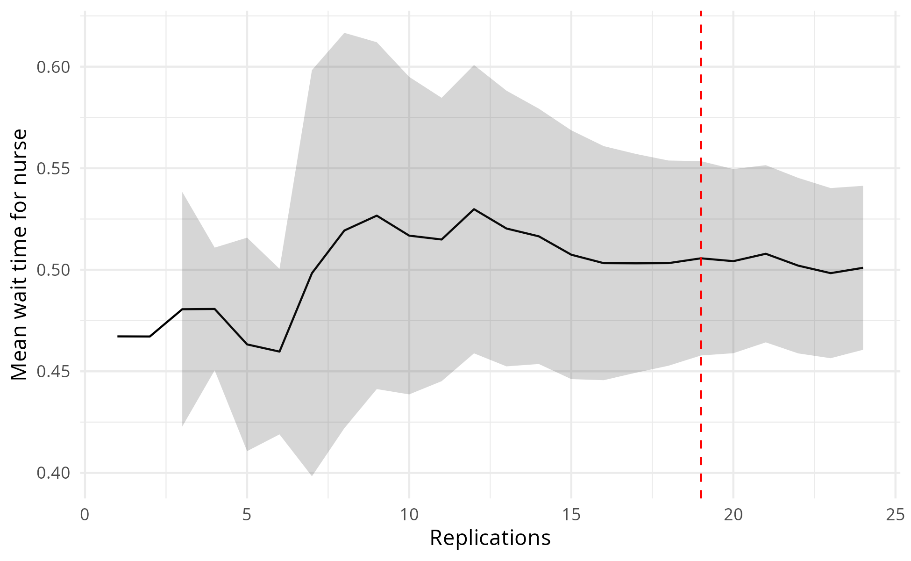<!-- -->

``` r
path <- file.path(output_dir, "reps_algorithm_serve_time.png")
plot_replication_ci(
  conf_ints = filter(alg$summary_table, metric == "mean_serve_time_nurse"),
  yaxis_title = "Mean time with nurse",
  file_path = path,
  min_rep = alg$nreps[["mean_serve_time_nurse"]]
)
include_graphics(path)
```

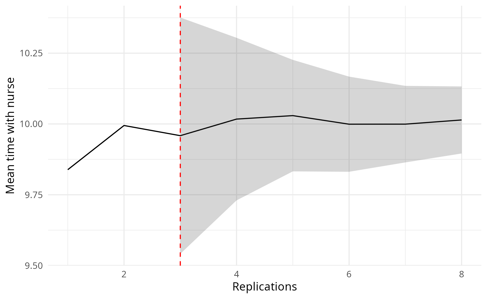<!-- -->

``` r
path <- file.path(output_dir, "reps_algorithm_utilisation.png")
plot_replication_ci(
  conf_ints = filter(alg$summary_table, metric == "utilisation_nurse"),
  yaxis_title = "Mean nurse utilisation",
  file_path = path,
  min_rep = alg$nreps[["utilisation_nurse"]]
)
include_graphics(path)
```

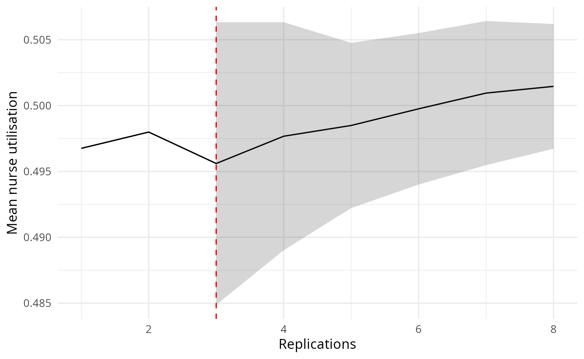<!-- -->

## Sensitivity analysis: running algorithm with seed offset

To check the stability of the suggested number of replications, run
again with a new set of seeds using `seed_offset`.

``` r
# Set up and run algorithm
alg <- ReplicationsAlgorithm$new(param = parameters(seed_offset = 1000L))
```

    ## [1] "Model parameters:"
    ## $patient_inter
    ## [1] 4
    ## 
    ## $mean_n_consult_time
    ## [1] 10
    ## 
    ## $number_of_nurses
    ## [1] 5
    ## 
    ## $warm_up_period
    ## [1] 10080
    ## 
    ## $data_collection_period
    ## [1] 20160
    ## 
    ## $number_of_runs
    ## [1] 25
    ## 
    ## $scenario_name
    ## NULL
    ## 
    ## $cores
    ## [1] 1
    ## 
    ## $seed_offset
    ## [1] 1000
    ## 
    ## $log_to_console
    ## [1] FALSE
    ## 
    ## $log_to_file
    ## [1] FALSE
    ## 
    ## $file_path
    ## NULL

``` r
alg$select()

# View results
alg$nreps
```

    ## $mean_waiting_time_nurse
    ## [1] 10
    ## 
    ## $mean_serve_time_nurse
    ## [1] 3
    ## 
    ## $utilisation_nurse
    ## [1] 3

``` r
alg$summary_table
```

    ##    replications       data cumulative_mean       stdev  lower_ci   upper_ci
    ## 1             1  0.5117878       0.5117878          NA        NA         NA
    ## 2             2  0.4614742       0.4866310          NA        NA         NA
    ## 3             3  0.4757557       0.4830059 0.025928515 0.4185959  0.5474159
    ## 4             4  0.5727835       0.5054503 0.049630584 0.4264770  0.5844236
    ## 5             5  0.4510381       0.4945679 0.049391629 0.4332401  0.5558957
    ## 6             6  0.5390701       0.5019849 0.047767148 0.4518564  0.5521134
    ## 7             7  0.3570115       0.4812744 0.070027762 0.4165095  0.5460393
    ## 8             8  0.4519212       0.4776053 0.065658463 0.4227134  0.5324971
    ## 9             9  0.5317849       0.4836252 0.064018079 0.4344166  0.5328339
    ## 10           10  0.5407115       0.4893338 0.062998651 0.4442673  0.5344004
    ## 11           11  0.6365009       0.5027127 0.074437020 0.4527052  0.5527201
    ## 12           12  0.5030761       0.5027430 0.070972991 0.4576489  0.5478370
    ## 13           13  0.4636800       0.4997381 0.068809735 0.4581568  0.5413194
    ## 14           14  0.6689347       0.5118236 0.080096110 0.4655775  0.5580697
    ## 15           15  0.6552948       0.5213883 0.085611980 0.4739780  0.5687987
    ## 16            1 10.0254785      10.0254785          NA        NA         NA
    ## 17            2 10.0074253      10.0164519          NA        NA         NA
    ## 18            3 10.0029263      10.0119434 0.011935664 9.9822935 10.0415932
    ## 19            4 10.0460112      10.0204603 0.019624686 9.9892331 10.0516876
    ## 20            5 10.3050777      10.0773838 0.128414375 9.9179363 10.2368313
    ## 21            6  9.9073301      10.0490415 0.134208457 9.9081984 10.1898846
    ## 22            7  9.8829917      10.0253201 0.137654856 9.8980106 10.1526296
    ## 23            8  9.9813839      10.0198281 0.128386828 9.9124940 10.1271622
    ## 24            1  0.4961528       0.4961528          NA        NA         NA
    ## 25            2  0.5044461       0.5002994          NA        NA         NA
    ## 26            3  0.4990688       0.4998892 0.004207070 0.4894383  0.5103402
    ## 27            4  0.5001537       0.4999553 0.003437602 0.4944853  0.5054253
    ## 28            5  0.5055505       0.5010744 0.003888943 0.4962456  0.5059031
    ## 29            6  0.4939485       0.4998867 0.004534549 0.4951280  0.5046454
    ## 30            7  0.4775227       0.4966919 0.009411965 0.4879872  0.5053965
    ## 31            8  0.5086875       0.4981913 0.009691083 0.4900894  0.5062933
    ##      deviation                  metric
    ## 1           NA mean_waiting_time_nurse
    ## 2           NA mean_waiting_time_nurse
    ## 3  0.133352408 mean_waiting_time_nurse
    ## 4  0.156243521 mean_waiting_time_nurse
    ## 5  0.124002814 mean_waiting_time_nurse
    ## 6  0.099860669 mean_waiting_time_nurse
    ## 7  0.134569544 mean_waiting_time_nurse
    ## 8  0.114931418 mean_waiting_time_nurse
    ## 9  0.101749557 mean_waiting_time_nurse
    ## 10 0.092097697 mean_waiting_time_nurse
    ## 11 0.099475254 mean_waiting_time_nurse
    ## 12 0.089696109 mean_waiting_time_nurse
    ## 13 0.083206194 mean_waiting_time_nurse
    ## 14 0.090355580 mean_waiting_time_nurse
    ## 15 0.090930945 mean_waiting_time_nurse
    ## 16          NA   mean_serve_time_nurse
    ## 17          NA   mean_serve_time_nurse
    ## 18 0.002961446   mean_serve_time_nurse
    ## 19 0.003116349   mean_serve_time_nurse
    ## 20 0.015822312   mean_serve_time_nurse
    ## 21 0.014015579   mean_serve_time_nurse
    ## 22 0.012698797   mean_serve_time_nurse
    ## 23 0.010712167   mean_serve_time_nurse
    ## 24          NA       utilisation_nurse
    ## 25          NA       utilisation_nurse
    ## 26 0.020906514       utilisation_nurse
    ## 27 0.010940962       utilisation_nurse
    ## 28 0.009636815       utilisation_nurse
    ## 29 0.009519592       utilisation_nurse
    ## 30 0.017525183       utilisation_nurse
    ## 31 0.016262725       utilisation_nurse

``` r
path <- file.path(output_dir, "reps_algorithm_wait_time_2.png")
plot_replication_ci(
  conf_ints = filter(alg$summary_table, metric == "mean_waiting_time_nurse"),
  yaxis_title = "Mean wait time for nurse",
  file_path = path,
  min_rep = alg$nreps[["mean_waiting_time_nurse"]]
)
include_graphics(path)
```

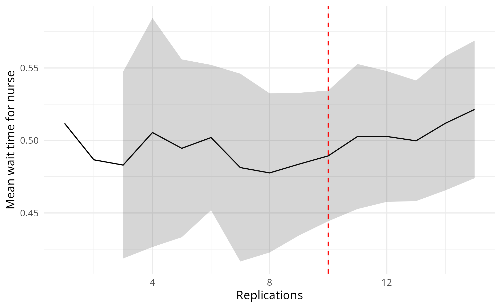<!-- -->

``` r
path <- file.path(output_dir, "reps_algorithm_serve_time_2.png")
plot_replication_ci(
  conf_ints = filter(alg$summary_table, metric == "mean_serve_time_nurse"),
  yaxis_title = "Mean time with nurse",
  file_path = path,
  min_rep = alg$nreps[["mean_serve_time_nurse"]]
)
include_graphics(path)
```

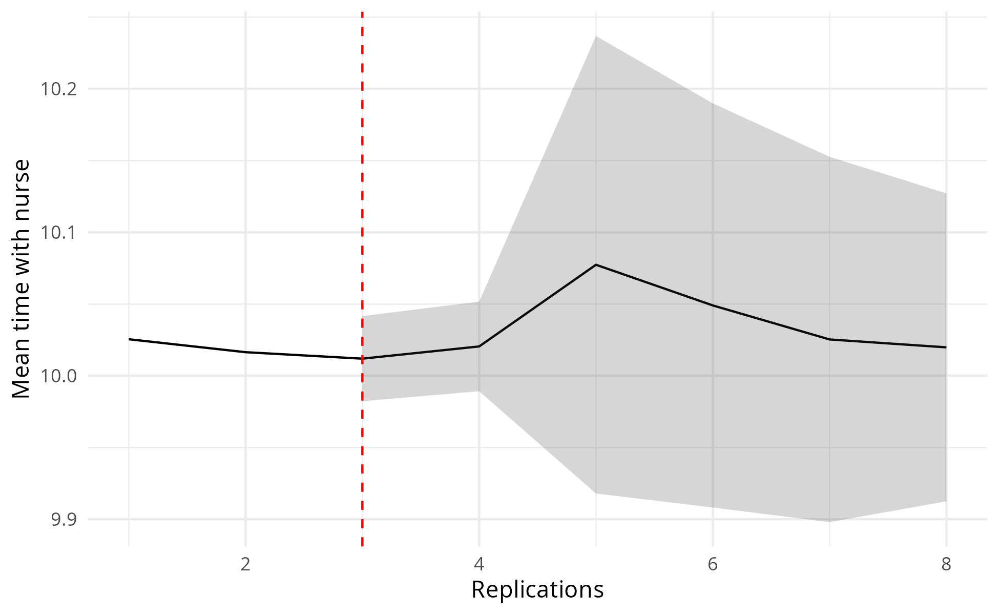<!-- -->

``` r
path <- file.path(output_dir, "reps_algorithm_utilisation_2.png")
plot_replication_ci(
  conf_ints = filter(alg$summary_table, metric == "utilisation_nurse"),
  yaxis_title = "Mean nurse utilisation",
  file_path = path,
  min_rep = alg$nreps[["utilisation_nurse"]]
)
include_graphics(path)
```

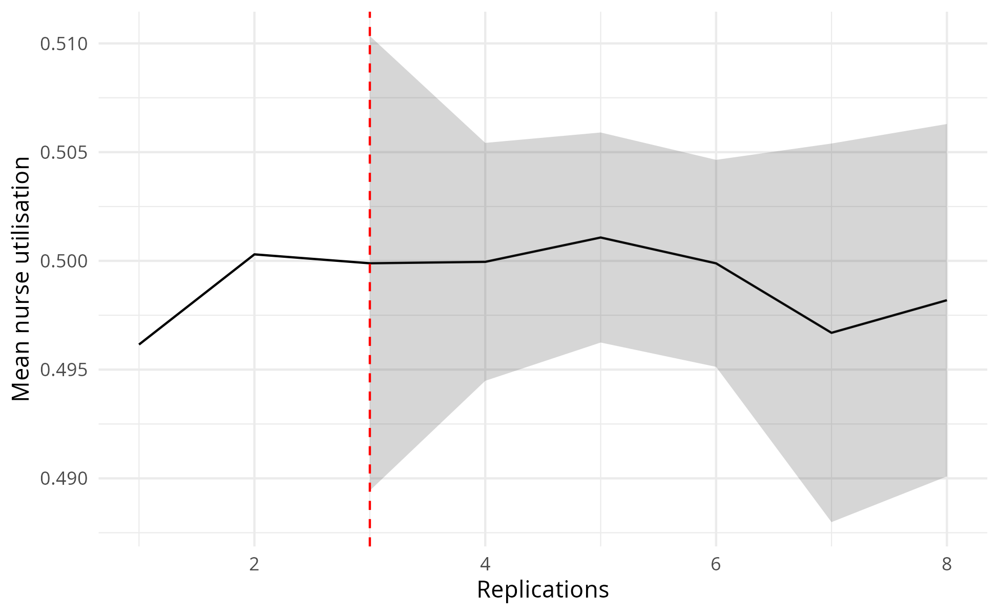<!-- -->

Further variations, just reporting number of replications:

``` r
seed_offsets <- seq(2000L, 10000L, by = 1000L)
sensitivity_nreps <- list()
for (offset in seed_offsets) {
  alg <- ReplicationsAlgorithm$new(param = parameters(seed_offset = offset))
  alg$select()
  sensitivity_nreps <- c(sensitivity_nreps, alg$nreps)
}
```

    ## [1] "Model parameters:"
    ## $patient_inter
    ## [1] 4
    ## 
    ## $mean_n_consult_time
    ## [1] 10
    ## 
    ## $number_of_nurses
    ## [1] 5
    ## 
    ## $warm_up_period
    ## [1] 10080
    ## 
    ## $data_collection_period
    ## [1] 20160
    ## 
    ## $number_of_runs
    ## [1] 25
    ## 
    ## $scenario_name
    ## NULL
    ## 
    ## $cores
    ## [1] 1
    ## 
    ## $seed_offset
    ## [1] 2000
    ## 
    ## $log_to_console
    ## [1] FALSE
    ## 
    ## $log_to_file
    ## [1] FALSE
    ## 
    ## $file_path
    ## NULL
    ## 
    ## [1] "Model parameters:"
    ## $patient_inter
    ## [1] 4
    ## 
    ## $mean_n_consult_time
    ## [1] 10
    ## 
    ## $number_of_nurses
    ## [1] 5
    ## 
    ## $warm_up_period
    ## [1] 10080
    ## 
    ## $data_collection_period
    ## [1] 20160
    ## 
    ## $number_of_runs
    ## [1] 25
    ## 
    ## $scenario_name
    ## NULL
    ## 
    ## $cores
    ## [1] 1
    ## 
    ## $seed_offset
    ## [1] 3000
    ## 
    ## $log_to_console
    ## [1] FALSE
    ## 
    ## $log_to_file
    ## [1] FALSE
    ## 
    ## $file_path
    ## NULL
    ## 
    ## [1] "Model parameters:"
    ## $patient_inter
    ## [1] 4
    ## 
    ## $mean_n_consult_time
    ## [1] 10
    ## 
    ## $number_of_nurses
    ## [1] 5
    ## 
    ## $warm_up_period
    ## [1] 10080
    ## 
    ## $data_collection_period
    ## [1] 20160
    ## 
    ## $number_of_runs
    ## [1] 25
    ## 
    ## $scenario_name
    ## NULL
    ## 
    ## $cores
    ## [1] 1
    ## 
    ## $seed_offset
    ## [1] 4000
    ## 
    ## $log_to_console
    ## [1] FALSE
    ## 
    ## $log_to_file
    ## [1] FALSE
    ## 
    ## $file_path
    ## NULL
    ## 
    ## [1] "Model parameters:"
    ## $patient_inter
    ## [1] 4
    ## 
    ## $mean_n_consult_time
    ## [1] 10
    ## 
    ## $number_of_nurses
    ## [1] 5
    ## 
    ## $warm_up_period
    ## [1] 10080
    ## 
    ## $data_collection_period
    ## [1] 20160
    ## 
    ## $number_of_runs
    ## [1] 25
    ## 
    ## $scenario_name
    ## NULL
    ## 
    ## $cores
    ## [1] 1
    ## 
    ## $seed_offset
    ## [1] 5000
    ## 
    ## $log_to_console
    ## [1] FALSE
    ## 
    ## $log_to_file
    ## [1] FALSE
    ## 
    ## $file_path
    ## NULL
    ## 
    ## [1] "Model parameters:"
    ## $patient_inter
    ## [1] 4
    ## 
    ## $mean_n_consult_time
    ## [1] 10
    ## 
    ## $number_of_nurses
    ## [1] 5
    ## 
    ## $warm_up_period
    ## [1] 10080
    ## 
    ## $data_collection_period
    ## [1] 20160
    ## 
    ## $number_of_runs
    ## [1] 25
    ## 
    ## $scenario_name
    ## NULL
    ## 
    ## $cores
    ## [1] 1
    ## 
    ## $seed_offset
    ## [1] 6000
    ## 
    ## $log_to_console
    ## [1] FALSE
    ## 
    ## $log_to_file
    ## [1] FALSE
    ## 
    ## $file_path
    ## NULL
    ## 
    ## [1] "Model parameters:"
    ## $patient_inter
    ## [1] 4
    ## 
    ## $mean_n_consult_time
    ## [1] 10
    ## 
    ## $number_of_nurses
    ## [1] 5
    ## 
    ## $warm_up_period
    ## [1] 10080
    ## 
    ## $data_collection_period
    ## [1] 20160
    ## 
    ## $number_of_runs
    ## [1] 25
    ## 
    ## $scenario_name
    ## NULL
    ## 
    ## $cores
    ## [1] 1
    ## 
    ## $seed_offset
    ## [1] 7000
    ## 
    ## $log_to_console
    ## [1] FALSE
    ## 
    ## $log_to_file
    ## [1] FALSE
    ## 
    ## $file_path
    ## NULL
    ## 
    ## [1] "Model parameters:"
    ## $patient_inter
    ## [1] 4
    ## 
    ## $mean_n_consult_time
    ## [1] 10
    ## 
    ## $number_of_nurses
    ## [1] 5
    ## 
    ## $warm_up_period
    ## [1] 10080
    ## 
    ## $data_collection_period
    ## [1] 20160
    ## 
    ## $number_of_runs
    ## [1] 25
    ## 
    ## $scenario_name
    ## NULL
    ## 
    ## $cores
    ## [1] 1
    ## 
    ## $seed_offset
    ## [1] 8000
    ## 
    ## $log_to_console
    ## [1] FALSE
    ## 
    ## $log_to_file
    ## [1] FALSE
    ## 
    ## $file_path
    ## NULL
    ## 
    ## [1] "Model parameters:"
    ## $patient_inter
    ## [1] 4
    ## 
    ## $mean_n_consult_time
    ## [1] 10
    ## 
    ## $number_of_nurses
    ## [1] 5
    ## 
    ## $warm_up_period
    ## [1] 10080
    ## 
    ## $data_collection_period
    ## [1] 20160
    ## 
    ## $number_of_runs
    ## [1] 25
    ## 
    ## $scenario_name
    ## NULL
    ## 
    ## $cores
    ## [1] 1
    ## 
    ## $seed_offset
    ## [1] 9000
    ## 
    ## $log_to_console
    ## [1] FALSE
    ## 
    ## $log_to_file
    ## [1] FALSE
    ## 
    ## $file_path
    ## NULL
    ## 
    ## [1] "Model parameters:"
    ## $patient_inter
    ## [1] 4
    ## 
    ## $mean_n_consult_time
    ## [1] 10
    ## 
    ## $number_of_nurses
    ## [1] 5
    ## 
    ## $warm_up_period
    ## [1] 10080
    ## 
    ## $data_collection_period
    ## [1] 20160
    ## 
    ## $number_of_runs
    ## [1] 25
    ## 
    ## $scenario_name
    ## NULL
    ## 
    ## $cores
    ## [1] 1
    ## 
    ## $seed_offset
    ## [1] 10000
    ## 
    ## $log_to_console
    ## [1] FALSE
    ## 
    ## $log_to_file
    ## [1] FALSE
    ## 
    ## $file_path
    ## NULL

``` r
print(sensitivity_nreps)
```

    ## $mean_waiting_time_nurse
    ## [1] 18
    ## 
    ## $mean_serve_time_nurse
    ## [1] 3
    ## 
    ## $utilisation_nurse
    ## [1] 3
    ## 
    ## $mean_waiting_time_nurse
    ## [1] 24
    ## 
    ## $mean_serve_time_nurse
    ## [1] 3
    ## 
    ## $utilisation_nurse
    ## [1] 3
    ## 
    ## $mean_waiting_time_nurse
    ## [1] 22
    ## 
    ## $mean_serve_time_nurse
    ## [1] 3
    ## 
    ## $utilisation_nurse
    ## [1] 3
    ## 
    ## $mean_waiting_time_nurse
    ## [1] 15
    ## 
    ## $mean_serve_time_nurse
    ## [1] 3
    ## 
    ## $utilisation_nurse
    ## [1] 3
    ## 
    ## $mean_waiting_time_nurse
    ## [1] 17
    ## 
    ## $mean_serve_time_nurse
    ## [1] 3
    ## 
    ## $utilisation_nurse
    ## [1] 4
    ## 
    ## $mean_waiting_time_nurse
    ## [1] 20
    ## 
    ## $mean_serve_time_nurse
    ## [1] 3
    ## 
    ## $utilisation_nurse
    ## [1] 3
    ## 
    ## $mean_waiting_time_nurse
    ## [1] 16
    ## 
    ## $mean_serve_time_nurse
    ## [1] 3
    ## 
    ## $utilisation_nurse
    ## [1] 3
    ## 
    ## $mean_waiting_time_nurse
    ## [1] 15
    ## 
    ## $mean_serve_time_nurse
    ## [1] 3
    ## 
    ## $utilisation_nurse
    ## [1] 3
    ## 
    ## $mean_waiting_time_nurse
    ## [1] 19
    ## 
    ## $mean_serve_time_nurse
    ## [1] 3
    ## 
    ## $utilisation_nurse
    ## [1] 3

## Chosen number of replications

Given the variations observed using the algorithm in the sensitivity
analysis, decided appropriate number of replications to be **25**.

## Explanation of the automated method

This section walks through how the automation code is structured. The
algorithm that determines the number of replications is
`ReplicationsAlgorithm`. This depends on other R6 classes including
`WelfordStats` and `ReplicationTabuliser`.

### WelfordStats

`WelfordStats` is designed to:

- Keep a **running mean and sum of squares**.
- Return **other statistics** based on these (e.g. standard deviation,
  confidence intervals).
- **Call the `update()`** method of `ReplicationTabuliser` whenever a
  new data point is processed by `WelfordStats`

#### How do the running mean and sum of squares calculations work?

The running mean and sum of squares are updated iteratively with each
new data point provided, **without requiring the storage of all previous
data points**. This approach can be referred to as “online” because we
only need to store a small set of values (such as the current mean and
sum of squares), rather than maintaining an entire list of past values.

For example, focusing on the mean, normally you would need to store all
the data points in a list and sum them up to compute the average - for
example:

    data_points <- c(1, 2, 3, 4, 5)
    mean <- sum(data_points) / length(data_points)

This works fine for small datasets, but as the data grows, maintaining
the entire list becomes impractical. Instead, we can update the mean
without storing the previous data points using **Welford’s online
algorithm**. The formula for the running mean is:

$$
\mu_n = \mu_{n-1} + \frac{x_n - \mu_{n-1}}{n}
$$

Where:

- $\mu_n$ is the running mean after the $n$-th data point.
- $x_n$ is the new data point.
- $\mu_{n-1}$ is the running mean before the new data point.

The key thing to notice here is that, to update the mean, **all we
needed to know was the current running mean, the new data point, and the
number of data points**. A similar formula exists for calculating the
sum of squares.

In our code, every time we call `update()` with a new data point, the
mean and sum of squares are adjusted, with `n` keeping track of the
number of data points so far - for example:

    WelfordStats <- R6Class("WelfordStats", list( # nolint: object_name_linter

      n = 0L,
      mean = NA,
      ...

      update = function(x) {
        self$n <- self$n + 1L
        ...
          updated_mean <- self$mean + ((x - self$mean) / self$n)
          ...
          self$mean <- updated_meam
          ...

#### What other statistics can it calculate?

`WelfordStats` then has a series of methods which can return other
statistics based on the current mean, sum of squares, and count:

- Variance
- Standard deviation
- Standard error
- Half width of the confidence interval
- Lower confidence interval bound
- Upper confidence interval bound
- Deviation of confidence interval from the mean

### ReplicationTabuliser

`ReplicationTabuliser` keeps track of our results. It:

- Stores **lists with various statistics**, which are updated whenever
  `update()` is called.
- Can convert these into a **dataframe** using the `summary_table()`
  method.

<figure>
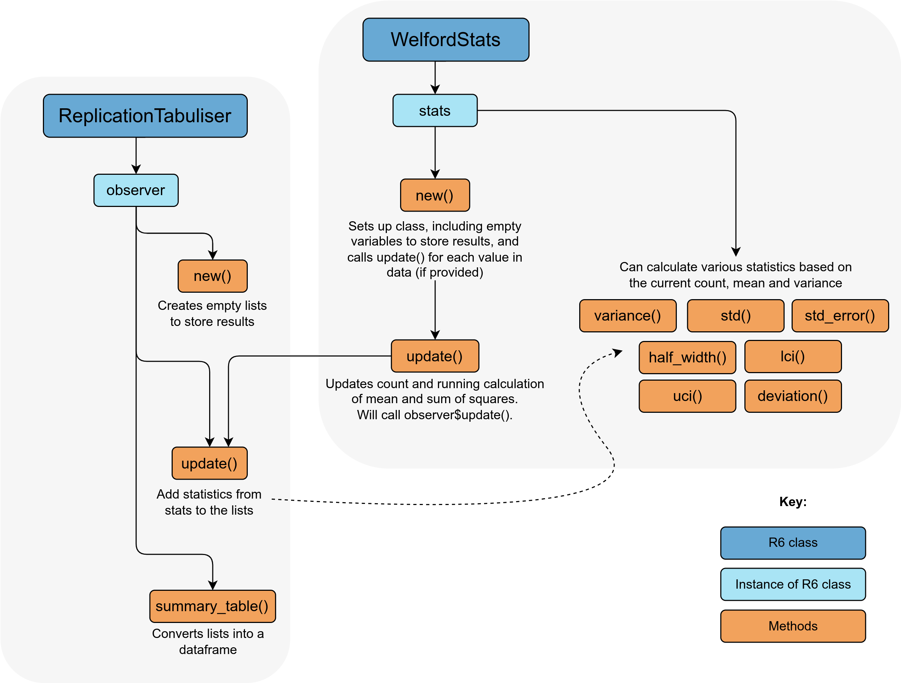
<figcaption aria-hidden="true">Interaction between WelfordStats and
ReplicationTabuliser</figcaption>
</figure>

### ReplicationsAlgorithm

The diagram below is a visual representation of the logic in the
**ReplicationsAlgorithm**.

Once set up with the relevant parameters, it will first check if there
are **initial_replications** to run. These might be specified if the
user knows that the model will need at least X amount of replications
before any metrics start to get close to the desired precision. The
benefit of specifying these is that they are run using **runner()** and
so can be run in parallel if chosen.

Once these are run, it checks if any metrics meet precision already.
Typically more replications will be required (for the length of the
lookahead period) - but if there is no lookahead, they can be marked as
solved.

> **What is the lookahead period?**
>
> We want to make sure that the desired precision is stable and
> maintained for several replications. Here, we refer to this as the
> lookahead period.
>
> The user will specify **look_ahead** - as noted in
> [sim-tools](https://sim-tools.github.io/sim-tools/04_replications/01_automated_reps.html),
> this is recommended to be **5** by [Hoad et
> al. (2010)](https://www.jstor.org/stable/40926090).
>
> The algorithm contains a method **klimit()** which will scale up the
> lookahead if more than 100 replications have been run, to ensure a
> sufficient period is being checked for stability, relative to the
> number of replications. This is simply:
> `look_ahead/100 * replications`. For example, if we have run 200
> replications and look_ahead is 5: `5/100 * 200 = 10`.

After any initial replications, the algorithm enters a while loop. This
continues until all metrics are solved or the number of replications
surpasses the user-specified **replication_budget** - whichever comes
first!

With each loop, it runs the model for another replication, then updates
the results for any unsolved metrics from this replication, and checks
if precision is met. The **target_met** is a record of how many times in
a row precision has been met - once this passes the lookahead period,
the metric is marked as solved.

<figure>
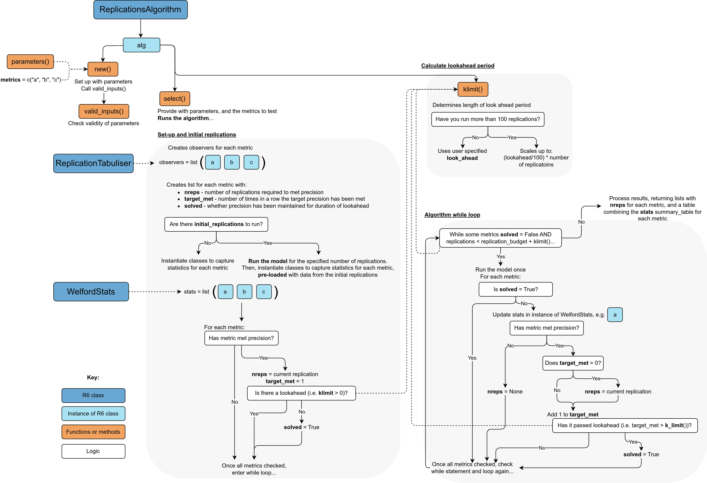
<figcaption aria-hidden="true">Visual representation of logic in
ReplicationsAlgorithm</figcaption>
</figure>

## Run time

``` r
# Get run time in seconds
end_time <- Sys.time()
runtime <- as.numeric(end_time - start_time, units = "secs")

# Display converted to minutes and seconds
minutes <- as.integer(runtime / 60L)
seconds <- as.integer(runtime %% 60L)
cat(sprintf("Notebook run time: %dm %ds", minutes, seconds))
```

    ## Notebook run time: 1m 20s
