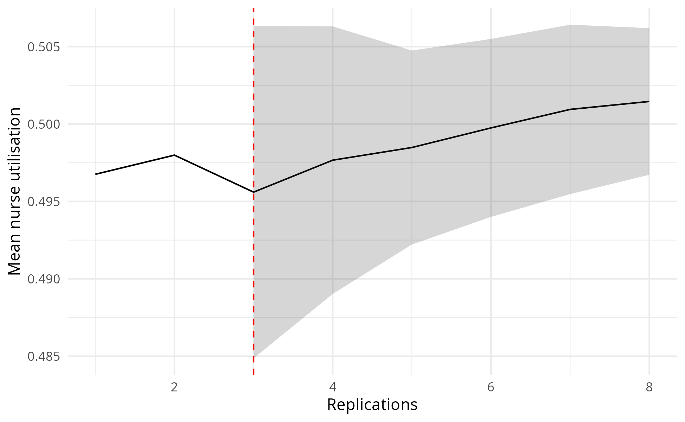

Choosing replications
================
Amy Heather
2025-03-17

- [Set up](#set-up)
- [Choosing the number of
  replications](#choosing-the-number-of-replications)
- [Automated detection of the number of
  replications](#automated-detection-of-the-number-of-replications)
- [Run time](#run-time)

This notebook documents the choice of the number of replications.

The generated images are saved and then loaded, so that we view the
image as saved (i.e. with the dimensions set in `ggsave()`). This also
avoids the creation of a `_files/` directory when knitting the document
(which would save all previewed images into that folder also, so they
can be rendered and displayed within the output `.md` file, even if we
had not specifically saved them). These are viewed using
`include_graphics()`, which must be the last command in the cell (or
last in the plotting function).

The run time is provided at the end of the notebook.

## Set up

Install the latest version of the local simulation package. If running
sequentially, `devtools::load_all()` is sufficient. If running in
parallel, you must use `devtools::install()`.

``` r
devtools::load_all()
```

    ## ℹ Loading simulation

Load required packages.

``` r
# nolint start: undesirable_function_linter.
library(data.table)
library(dplyr)
```

    ## 
    ## Attaching package: 'dplyr'

    ## The following objects are masked from 'package:data.table':
    ## 
    ##     between, first, last

    ## The following object is masked from 'package:testthat':
    ## 
    ##     matches

    ## The following objects are masked from 'package:stats':
    ## 
    ##     filter, lag

    ## The following objects are masked from 'package:base':
    ## 
    ##     intersect, setdiff, setequal, union

``` r
library(knitr)
library(simulation)
library(tidyr)
```

    ## 
    ## Attaching package: 'tidyr'

    ## The following object is masked from 'package:testthat':
    ## 
    ##     matches

``` r
options(data.table.summarise.inform = FALSE)
options(dplyr.summarise.inform = FALSE)
# nolint end
```

Start timer.

``` r
start_time <- Sys.time()
```

Define path to outputs folder.

``` r
output_dir <- file.path("..", "outputs")
```

## Choosing the number of replications

The **confidence interval method** can be used to select the number of
replications to run. The more replications you run, the narrower your
confidence interval becomes, leading to a more precise estimate of the
model’s mean performance.

First, you select a desired confidence interval - for example, 95%.
Then, run the model with an increasing number of replications, and
identify the number required to achieve that precision in the estimate
of a given metric - and also, to maintain that precision (as the
intervals may converge or expand again later on).

This method is less useful for values very close to zero - so, for
example, when using utilisation (which ranges from 0 to 1) it is
recommended to multiple values by 100.

When selecting the number of replications you should repeat the analysis
for all performance measures and select the highest value as your number
of replications.

It’s important to check ahead, to check that the 5% precision is
maintained - which is fine in this case - it doesn’t go back up to
future deviation.

``` r
# Run calculations and produce plot
ci_df <- confidence_interval_method(
  replications = 150L,
  desired_precision = 0.05,
  metric = "mean_serve_time_nurse"
)
```

    ## Reached desired precision (0.05) in 83 replications.

``` r
# Preview dataframe
head(ci_df)
```

    ##   replications      data cumulative_mean    stdev lower_ci upper_ci deviation
    ## 1            1 10.808606       10.808606       NA       NA       NA        NA
    ## 2            2  9.319953       10.064280       NA       NA       NA        NA
    ## 3            3 12.141014       10.756525 1.411251 7.250782 14.26227 0.3259178
    ## 4            4  8.889448       10.289755 1.482986 7.929994 12.64952 0.2293312
    ## 5            5  7.603423        9.752489 1.758611 7.568885 11.93609 0.2239022
    ## 6            6  5.009584        8.962005 2.494667 6.344013 11.58000 0.2921212
    ##                  metric
    ## 1 mean_serve_time_nurse
    ## 2 mean_serve_time_nurse
    ## 3 mean_serve_time_nurse
    ## 4 mean_serve_time_nurse
    ## 5 mean_serve_time_nurse
    ## 6 mean_serve_time_nurse

``` r
# View first ten rows where percentage deviation is below 5
ci_df %>%
  filter(deviation < 5L) %>%
  head(10L)
```

    ##    replications      data cumulative_mean    stdev lower_ci upper_ci deviation
    ## 1             3 12.141014       10.756525 1.411251 7.250782 14.26227 0.3259178
    ## 2             4  8.889448       10.289755 1.482986 7.929994 12.64952 0.2293312
    ## 3             5  7.603423        9.752489 1.758611 7.568885 11.93609 0.2239022
    ## 4             6  5.009584        8.962005 2.494667 6.344013 11.58000 0.2921212
    ## 5             7 10.140922        9.130421 2.320492 6.984324 11.27652 0.2350491
    ## 6             8  8.303760        9.027089 2.168148 7.214472 10.83971 0.2007975
    ## 7             9  8.667355        8.987118 2.031658 7.425448 10.54879 0.1737677
    ## 8            10 10.806375        9.169044 1.999995 7.738334 10.59975 0.1560370
    ## 9            11 15.829847        9.774571 2.762839 7.918471 11.63067 0.1898907
    ## 10           12 12.654772       10.014588 2.762362 8.259467 11.76971 0.1752564
    ##                   metric
    ## 1  mean_serve_time_nurse
    ## 2  mean_serve_time_nurse
    ## 3  mean_serve_time_nurse
    ## 4  mean_serve_time_nurse
    ## 5  mean_serve_time_nurse
    ## 6  mean_serve_time_nurse
    ## 7  mean_serve_time_nurse
    ## 8  mean_serve_time_nurse
    ## 9  mean_serve_time_nurse
    ## 10 mean_serve_time_nurse

``` r
# Create plot
path <- file.path(output_dir, "conf_int_method_serve_time.png")
plot_replication_ci(
  conf_ints = ci_df,
  yaxis_title = "Mean time with nurse",
  file_path = path,
  min_rep = 86L
)
# View plot
include_graphics(path)
```

<!-- -->

It is also important to check across multiple metrics.

``` r
# Run calculations
ci_df <- confidence_interval_method(
  replications = 1000L,
  desired_precision = 0.05,
  metric = "mean_waiting_time_nurse"
)
```

    ## Warning: Running 1000 replications did not reach desired precision (0.05).

``` r
# Preview dataframe
tail(ci_df)
```

    ##      replications      data cumulative_mean     stdev  lower_ci  upper_ci
    ## 995           995 0.0000000       0.2448502 0.5815286 0.2086729 0.2810276
    ## 996           996 0.5931650       0.2451999 0.5813411 0.2090525 0.2813474
    ## 997           997 0.2294206       0.2451841 0.5810494 0.2090729 0.2812953
    ## 998           998 0.0869829       0.2450256 0.5807795 0.2089493 0.2811019
    ## 999           999 0.1404389       0.2449209 0.5804979 0.2088802 0.2809616
    ## 1000         1000 0.0000000       0.2446760 0.5802590 0.2086682 0.2806838
    ##      deviation                  metric
    ## 995  0.1477530 mean_waiting_time_nurse
    ## 996  0.1474204 mean_waiting_time_nurse
    ## 997  0.1472819 mean_waiting_time_nurse
    ## 998  0.1472347 mean_waiting_time_nurse
    ## 999  0.1471523 mean_waiting_time_nurse
    ## 1000 0.1471652 mean_waiting_time_nurse

``` r
# Create plot
path <- file.path(output_dir, "conf_int_method_wait_time.png")
plot_replication_ci(
  conf_ints = ci_df,
  yaxis_title = "Mean wait time for the nurse",
  file_path = path
)
# View plot
include_graphics(path)
```

<!-- -->

``` r
# Run calculations
ci_df <- confidence_interval_method(
  replications = 200L,
  desired_precision = 0.05,
  metric = "utilisation_nurse"
)
```

    ## Reached desired precision (0.05) in 128 replications.

``` r
# Preview dataframe
head(ci_df)
```

    ##   replications      data cumulative_mean      stdev  lower_ci  upper_ci
    ## 1            1 0.6003166       0.6003166         NA        NA        NA
    ## 2            2 0.4686088       0.5344627         NA        NA        NA
    ## 3            3 0.6440834       0.5710029 0.09133618 0.3441113 0.7978946
    ## 4            4 0.3507966       0.5159514 0.13298209 0.3043472 0.7275555
    ## 5            5 0.3423309       0.4812273 0.13889561 0.3087656 0.6536889
    ## 6            6 0.2285129       0.4391082 0.16148587 0.2696392 0.6085772
    ##   deviation            metric
    ## 1        NA utilisation_nurse
    ## 2        NA utilisation_nurse
    ## 3 0.3973564 utilisation_nurse
    ## 4 0.4101243 utilisation_nurse
    ## 5 0.3583789 utilisation_nurse
    ## 6 0.3859391 utilisation_nurse

``` r
# View first ten rows where percentage deviation is below 5
ci_df %>%
  filter(deviation < 5L) %>%
  head(10L)
```

    ##    replications      data cumulative_mean      stdev  lower_ci  upper_ci
    ## 1             3 0.6440834       0.5710029 0.09133618 0.3441113 0.7978946
    ## 2             4 0.3507966       0.5159514 0.13298209 0.3043472 0.7275555
    ## 3             5 0.3423309       0.4812273 0.13889561 0.3087656 0.6536889
    ## 4             6 0.2285129       0.4391082 0.16148587 0.2696392 0.6085772
    ## 5             7 0.5248777       0.4513610 0.15093814 0.3117665 0.5909555
    ## 6             8 0.4061181       0.4457056 0.14065408 0.3281159 0.5632954
    ## 7             9 0.3583505       0.4359995 0.13475349 0.3324188 0.5395802
    ## 8            10 0.5611832       0.4485179 0.13307137 0.3533244 0.5437114
    ## 9            11 0.5558867       0.4582787 0.13032726 0.3707236 0.5458337
    ## 10           12 0.4866132       0.4606399 0.12453108 0.3815166 0.5397632
    ##    deviation            metric
    ## 1  0.3973564 utilisation_nurse
    ## 2  0.4101243 utilisation_nurse
    ## 3  0.3583789 utilisation_nurse
    ## 4  0.3859391 utilisation_nurse
    ## 5  0.3092746 utilisation_nurse
    ## 6  0.2638283 utilisation_nurse
    ## 7  0.2375707 utilisation_nurse
    ## 8  0.2122402 utilisation_nurse
    ## 9  0.1910520 utilisation_nurse
    ## 10 0.1717682 utilisation_nurse

``` r
# Create plot
path <- file.path(output_dir, "conf_int_method_utilisation.png")
plot_replication_ci(
  conf_ints = ci_df,
  yaxis_title = "Mean nurse utilisation",
  file_path = path,
  min_rep = 151L
)
# View plot
include_graphics(path)
```

<!-- -->

## Automated detection of the number of replications

Run the algorithm (which will run model with increasing reps) for a few
different metrics.

``` r
# Set up and run algorithm
alg <- ReplicationsAlgorithm$new(param = parameters())
alg$select()
```

    ## Warning: The replications did not reach the desired precision for the following
    ## metrics - mean_waiting_time_nurse

``` r
# View results
alg$nreps
```

    ## $mean_waiting_time_nurse
    ## [1] NA
    ## 
    ## $mean_serve_time_nurse
    ## [1] 83
    ## 
    ## $utilisation_nurse
    ## [1] 128

``` r
head(alg$summary_table)
```

    ##   replications      data cumulative_mean     stdev    lower_ci  upper_ci
    ## 1            1 0.3259768       0.3259768        NA          NA        NA
    ## 2            2 0.0000000       0.1629884        NA          NA        NA
    ## 3            3 0.4744693       0.2668154 0.2427042 -0.33609536 0.8697261
    ## 4            4 0.0000000       0.2001115 0.2388888 -0.18001380 0.5802369
    ## 5            5 0.0000000       0.1600892 0.2254103 -0.11979464 0.4399731
    ## 6            6 0.0000000       0.1334077 0.2119417 -0.08901145 0.3558269
    ##   deviation                  metric
    ## 1        NA mean_waiting_time_nurse
    ## 2        NA mean_waiting_time_nurse
    ## 3  2.259655 mean_waiting_time_nurse
    ## 4  1.899567 mean_waiting_time_nurse
    ## 5  1.748299 mean_waiting_time_nurse
    ## 6  1.667214 mean_waiting_time_nurse

Visualise results for each metric…

``` r
path <- file.path(output_dir, "reps_algorithm_wait_time.png")
plot_replication_ci(
  conf_ints = filter(alg$summary_table, metric == "mean_waiting_time_nurse"),
  yaxis_title = "Mean wait time for nurse",
  file_path = path
)
include_graphics(path)
```

<!-- -->

``` r
path <- file.path(output_dir, "reps_algorithm_serve_time.png")
plot_replication_ci(
  conf_ints = filter(alg$summary_table, metric == "mean_serve_time_nurse"),
  yaxis_title = "Mean time with nurse",
  file_path = path,
  min_rep = alg$nreps[["mean_serve_time_nurse"]])
include_graphics(path)
```

<!-- -->

``` r
path <- file.path(output_dir, "reps_algorithm_utilisation.png")
plot_replication_ci(
  conf_ints = filter(alg$summary_table, metric == "utilisation_nurse"),
  yaxis_title = "Mean nurse utilisation",
  file_path = path,
  min_rep = alg$nreps[["utilisation_nurse"]]
)
include_graphics(path)
```

<!-- -->

## Run time

``` r
# Get run time in seconds
end_time <- Sys.time()
runtime <- as.numeric(end_time - start_time, units = "secs")

# Display converted to minutes and seconds
minutes <- as.integer(runtime / 60L)
seconds <- as.integer(runtime %% 60L)
cat(sprintf("Notebook run time: %dm %ds", minutes, seconds))
```

    ## Notebook run time: 3m 1s
