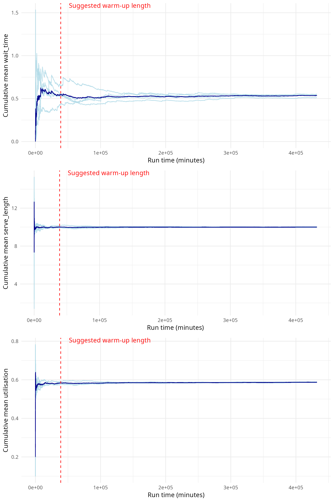

Choosing warm-up length
================
Amy Heather
2025-03-12

- [Set-up](#set-up)
- [Determining appropriate warm-up
  length](#determining-appropriate-warm-up-length)
- [Run time](#run-time)

A suitable length for the warm-up period can be determined using the
**time series inspection approach**. This involves looking at
performance measures over time to identify when the system is exhibiting
**steady state behaviour** (even though the system will never truly
reach a “steady state”).

If we simply plot the mean result at regular intervals, this would vary
too much. Therefore, we plot the **cumulative mean** of the performance
measure, and look for the point at which this **smoothes out and
stabilises**. This indicates the point for the warm-up period to end.

This should be assessed when running the model using the base case
parameters. If these change, you should reassess the appropriate warm-up
period.

We should:

- Run the model with **multiple replications** (e.g. at least five).
- Use a **long run length** (i.e. 5-10 times actual planned run length).

The run time is provided at the end of the document.

## Set-up

Install the latest version of the local simulation package. If running
sequentially, `devtools::load_all()` is sufficient. If running in
parallel, you must use `devtools::install()`.

``` r
devtools::load_all()
```

    ## ℹ Loading simulation

Load required packages.

``` r
# nolint start: undesirable_function_linter.
library(knitr)
library(simulation)

options(data.table.summarise.inform = FALSE)
options(dplyr.summarise.inform = FALSE)
# nolint end
```

Start timer.

``` r
start_time <- Sys.time()
```

Define path to outputs folder.

``` r
output_dir <- file.path("..", "outputs")
```

## Determining appropriate warm-up length

Run the model, ensuring multiple replications and a sufficient data
collection period are used.

``` r
data_collection_period <- 50000L

# Use default parameters, but with no warm-up, five replications, and the
# specified data collection period
param <- parameters(
  warm_up_period = 0L,
  data_collection_period = data_collection_period,
  number_of_runs = 5L
)

# Run model
result <- runner(param)
```

For each replication, find the average result per interval in the
simulation.

``` r
interval_audit <- get_interval_means(result, interval_size = 50L)
interval_audit
```

    ## [[1]]
    ## # A tibble: 5,000 × 3
    ##    interval replication arrivals
    ##       <dbl>       <int>    <int>
    ##  1       50           1        8
    ##  2       50           2       15
    ##  3       50           3       17
    ##  4       50           4       12
    ##  5       50           5       21
    ##  6      100           1       13
    ##  7      100           2        6
    ##  8      100           3       18
    ##  9      100           4       10
    ## 10      100           5       10
    ## # ℹ 4,990 more rows
    ## 
    ## [[2]]
    ## # A tibble: 5,000 × 3
    ##    interval replication mean_waiting_time_nurse
    ##       <dbl>       <int>                   <dbl>
    ##  1       50           1                  0     
    ##  2       50           2                  0.128 
    ##  3       50           3                  0     
    ##  4       50           4                  0     
    ##  5       50           5                  0.320 
    ##  6      100           1                  0.0389
    ##  7      100           2                  0     
    ##  8      100           3                  0.0136
    ##  9      100           4                  0     
    ## 10      100           5                  0.135 
    ## # ℹ 4,990 more rows
    ## 
    ## [[3]]
    ## # A tibble: 5,000 × 3
    ##    interval replication mean_serve_time_nurse
    ##       <dbl>       <int>                 <dbl>
    ##  1       50           1                  7.04
    ##  2       50           2                  9.76
    ##  3       50           3                 12.2 
    ##  4       50           4                 10.6 
    ##  5       50           5                  9.27
    ##  6      100           1                  7.49
    ##  7      100           2                  9.12
    ##  8      100           3                 10.6 
    ##  9      100           4                 11.6 
    ## 10      100           5                  8.01
    ## # ℹ 4,990 more rows
    ## 
    ## [[4]]
    ## # A tibble: 5,000 × 3
    ##    interval replication utilisation_nurse
    ##       <dbl>       <int>             <dbl>
    ##  1       50           1             0.281
    ##  2       50           2             0.461
    ##  3       50           3             0.760
    ##  4       50           4             0.540
    ##  5       50           5             0.726
    ##  6      100           1             0.398
    ##  7      100           2             0.304
    ##  8      100           3             0.518
    ##  9      100           4             0.295
    ## 10      100           5             0.326
    ## # ℹ 4,990 more rows
    ## 
    ## [[5]]
    ## # A tibble: 5,000 × 3
    ##    interval replication count_unseen_nurse
    ##       <dbl>       <int>              <int>
    ##  1       50           1                  0
    ##  2       50           2                  0
    ##  3       50           3                  0
    ##  4       50           4                  0
    ##  5       50           5                  0
    ##  6      100           1                  0
    ##  7      100           2                  0
    ##  8      100           3                  0
    ##  9      100           4                  0
    ## 10      100           5                  0
    ## # ℹ 4,990 more rows
    ## 
    ## [[6]]
    ## # A tibble: 5,000 × 3
    ##    interval replication mean_waiting_time_unseen_nurse
    ##       <dbl>       <int>                          <dbl>
    ##  1       50           1                            NaN
    ##  2       50           2                            NaN
    ##  3       50           3                            NaN
    ##  4       50           4                            NaN
    ##  5       50           5                            NaN
    ##  6      100           1                            NaN
    ##  7      100           2                            NaN
    ##  8      100           3                            NaN
    ##  9      100           4                            NaN
    ## 10      100           5                            NaN
    ## # ℹ 4,990 more rows

Run function which calculates and plots cumulative results for each
metric. Run on all except unseen counts (as those are just 0 / NA for
this model).

``` r
path <- file.path(output_dir, "choose_param_time_series.png")

time_series_inspection(
  df_list = interval_audit[1L:4L],
  file_path = path,
  warm_up = 10000L
)
```

``` r
include_graphics(path)
```

<!-- -->

## Run time

``` r
# Get run time in seconds
end_time <- Sys.time()
runtime <- as.numeric(end_time - start_time, units = "secs")

# Display converted to minutes and seconds
minutes <- as.integer(runtime / 60L)
seconds <- as.integer(runtime %% 60L)
cat(sprintf("Notebook run time: %dm %ds", minutes, seconds))
```

    ## Notebook run time: 0m 2s
